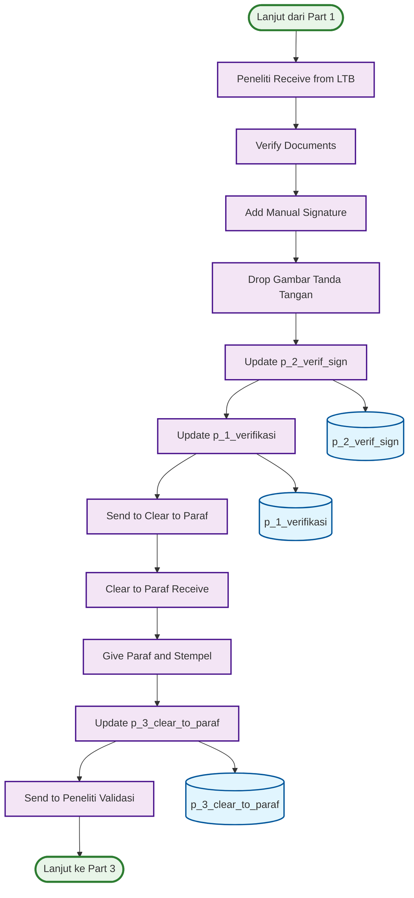

# ACTIVITY DIAGRAM - ITERASI 1 (PART 2)
## Peneliti → Clear to Paraf Process (Halaman 2)

## WORKFLOW PART 2 - PENELITI → CLEAR TO PARAF:

### 🎯 **Peneliti Process (7 langkah):**
1. **Peneliti Receive from LTB** - Terima dari LTB
2. **Verify Documents** - Verifikasi dokumen
3. **Add Manual Signature** - Tambahkan tanda tangan manual
4. **Drop Gambar Tanda Tangan** - Drop gambar tanda tangan
5. **Update p_2_verif_sign** - Update database tanda tangan
6. **Update p_1_verifikasi** - Update database verifikasi
7. **Send to Clear to Paraf** - Kirim ke Clear to Paraf

### 🎯 **Clear to Paraf Process (4 langkah):**
1. **Clear to Paraf Receive** - Terima dari peneliti
2. **Give Paraf and Stempel** - Berikan paraf dan stempel
3. **Update p_3_clear_to_paraf** - Update database clear to paraf
4. **Send to Peneliti Validasi** - Kirim ke peneliti validasi

## DATABASE TABLES - PART 2 (3 TABEL):

### 🎯 **Process Tables:**
1. **p_2_verif_sign** - Tanda tangan peneliti
2. **p_1_verifikasi** - Verifikasi peneliti
3. **p_3_clear_to_paraf** - Clear to paraf

## KEY FEATURES - PART 2:

### ✅ **Peneliti Features:**
- **Document Verification** - Verifikasi dokumen
- **Manual Signature** - Tanda tangan manual
- **Drop Gambar** - Drop gambar tanda tangan
- **Database Updates** - Update 2 database tables

### ✅ **Clear to Paraf Features:**
- **Paraf and Stempel** - Berikan paraf dan stempel
- **Database Update** - Update p_3_clear_to_paraf
- **Process Continuation** - Lanjut ke peneliti validasi

### ✅ **Database Integration:**
- **3 Database Tables** - Terintegrasi dengan proses
- **Real-time Updates** - Update database di setiap tahap
- **Status Management** - Management status verifikasi

## WORKFLOW SUMMARY - PART 2:

### 📋 **Total Steps: 11 Langkah**
- **Peneliti Process**: 7 langkah
- **Clear to Paraf Process**: 4 langkah
- **Database Updates**: 3 tables
- **No Decision Points** - Sequential flow

### 📋 **Process Flow:**
- **Sequential**: Peneliti → Clear to Paraf
- **Manual Processes** - Tanda tangan manual di setiap tahap
- **Database** - 3 tables terintegrasi
- **Continuation** - Lanjut ke Part 3

### 📋 **Manual Signature Process:**
- **Peneliti** - Drop gambar tanda tangan
- **Clear to Paraf** - Paraf dan stempel manual
- **Database Updates** - Update database di setiap tahap
- **Process Control** - Kontrol proses verifikasi
