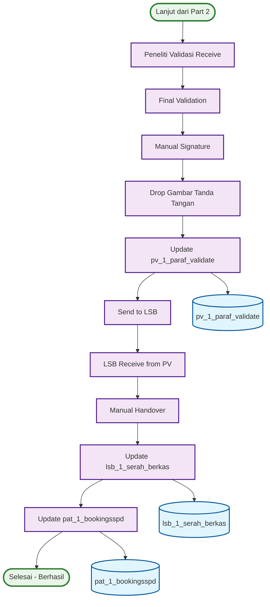

# ACTIVITY DIAGRAM - ITERASI 1 (PART 3)
## Peneliti Validasi → LSB Process (Halaman 3)

## WORKFLOW PART 3 - PENELITI VALIDASI → LSB:

### 🎯 **Peneliti Validasi Process (6 langkah):**
1. **Peneliti Validasi Receive** - Terima dari Clear to Paraf
2. **Final Validation** - Validasi akhir
3. **Manual Signature** - Tanda tangan manual
4. **Drop Gambar Tanda Tangan** - Drop gambar tanda tangan
5. **Update pv_1_paraf_validate** - Update database validasi
6. **Send to LSB** - Kirim ke Loket Serah Berkas

### 🎯 **LSB Process (5 langkah):**
1. **LSB Receive from PV** - Terima dari peneliti validasi
2. **Manual Handover** - Serah terima manual
3. **Update lsb_1_serah_berkas** - Update database serah berkas
4. **Update pat_1_bookingsspd** - Update status booking utama
5. **Selesai - Berhasil** - Proses selesai

## DATABASE TABLES - PART 3 (3 TABEL):

### 🎯 **Process Tables:**
1. **pv_1_paraf_validate** - Validasi peneliti validasi
2. **lsb_1_serah_berkas** - Serah berkas LSB
3. **pat_1_bookingsspd** - Update status booking utama

## KEY FEATURES - PART 3:

### ✅ **Peneliti Validasi Features:**
- **Final Validation** - Validasi akhir oleh pejabat
- **Manual Signature** - Tanda tangan manual pejabat
- **Drop Gambar** - Drop gambar tanda tangan
- **Database Update** - Update pv_1_paraf_validate

### ✅ **LSB Features:**
- **Manual Handover** - Serah terima manual
- **Database Updates** - Update 2 database tables
- **Status Completion** - Update status booking utama
- **Process Finalization** - Finalisasi proses

### ✅ **Database Integration:**
- **3 Database Tables** - Terintegrasi dengan proses
- **Real-time Updates** - Update database di setiap tahap
- **Status Management** - Management status final

## WORKFLOW SUMMARY - PART 3:

### 📋 **Total Steps: 11 Langkah**
- **Peneliti Validasi Process**: 6 langkah
- **LSB Process**: 5 langkah
- **Database Updates**: 3 tables
- **No Decision Points** - Sequential flow

### 📋 **Process Flow:**
- **Sequential**: Peneliti Validasi → LSB
- **Manual Processes** - Tanda tangan manual di setiap tahap
- **Database** - 3 tables terintegrasi
- **Completion** - Proses selesai

### 📋 **Final Process:**
- **Pejabat Validation** - Validasi akhir oleh pejabat
- **Manual Handover** - Serah terima manual
- **Status Update** - Update status booking utama
- **Process Complete** - Proses booking selesai

## COMPLETE WORKFLOW SUMMARY:

### 📋 **Total Steps: 35 Langkah (3 Parts)**
- **Part 1**: 13 langkah (PPAT → LTB)
- **Part 2**: 11 langkah (Peneliti → Clear to Paraf)
- **Part 3**: 11 langkah (Peneliti Validasi → LSB)

### 📋 **Database Tables: 12 Tables Total**
- **Part 1**: 7 tables (Booking + LTB)
- **Part 2**: 3 tables (Peneliti + Clear to Paraf)
- **Part 3**: 3 tables (Peneliti Validasi + LSB)

### 📋 **Decision Points: 1 Total**
- **Part 1**: 1 decision (Diterima/Ditolak)
- **Part 2**: 0 decisions
- **Part 3**: 0 decisions

### 📋 **End Points: 2 Total**
- **Part 1**: Selesai - Ditolak
- **Part 3**: Selesai - Berhasil
