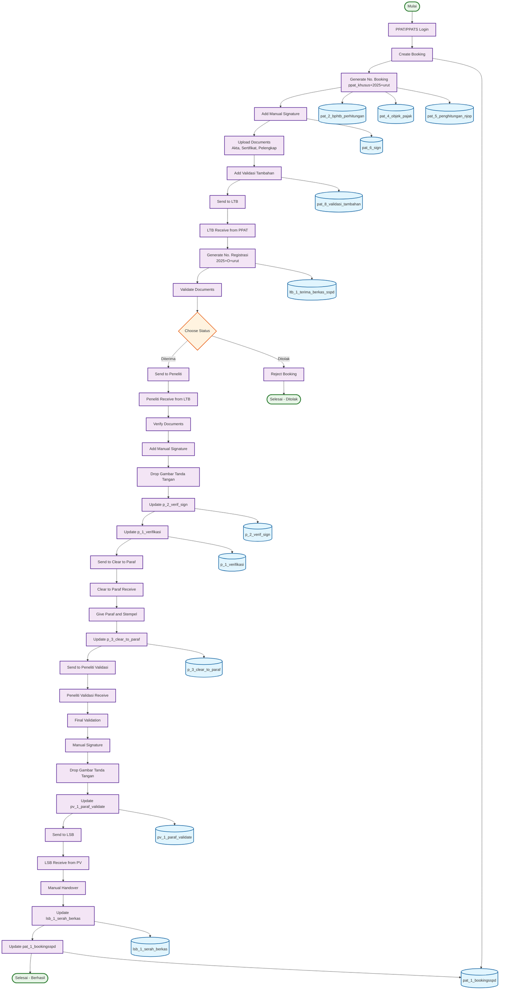

# ACTIVITY DIAGRAM - ITERASI 1
## Pembuatan Booking hingga Pengiriman (November 2024 - Januari 2025)

## WORKFLOW ITERASI 1 - ACTIVITY DIAGRAM:

### 🎯 **Tahap 1: PPAT/PPATS Process**
1. **PPAT/PPATS Login** - Login ke sistem
2. **Create Booking** - Membuat booking baru
3. **Generate No. Booking** - Generate nomor booking (ppat_khusus+2025+urut)
4. **Add Manual Signature** - Tambahkan tanda tangan manual
5. **Upload Documents** - Upload akta, sertifikat, dokumen pelengkap
6. **Add Validasi Tambahan** - Tambahkan validasi tambahan
7. **Send to LTB** - Kirim ke Loket Terima Berkas

### 🎯 **Tahap 2: LTB Process**
1. **LTB Receive from PPAT** - Terima dari PPAT
2. **Generate No. Registrasi** - Generate nomor registrasi (2025+O+urut)
3. **Validate Documents** - Validasi dokumen
4. **Choose Status** - Pilih status (Diterima/Ditolak)
5. **Send to Peneliti** - Kirim ke peneliti (jika diterima)
6. **Reject Booking** - Tolak booking (jika ditolak)

### 🎯 **Tahap 3: Peneliti Process**
1. **Peneliti Receive from LTB** - Terima dari LTB
2. **Verify Documents** - Verifikasi dokumen
3. **Add Manual Signature** - Tambahkan tanda tangan manual
4. **Drop Gambar Tanda Tangan** - Drop gambar tanda tangan
5. **Update p_2_verif_sign** - Update database tanda tangan
6. **Update p_1_verifikasi** - Update database verifikasi
7. **Send to Clear to Paraf** - Kirim ke Clear to Paraf

### 🎯 **Tahap 4: Clear to Paraf Process**
1. **Clear to Paraf Receive** - Terima dari peneliti
2. **Give Paraf and Stempel** - Berikan paraf dan stempel
3. **Update p_3_clear_to_paraf** - Update database clear to paraf
4. **Send to Peneliti Validasi** - Kirim ke peneliti validasi

### 🎯 **Tahap 5: Peneliti Validasi Process**
1. **Peneliti Validasi Receive** - Terima dari Clear to Paraf
2. **Final Validation** - Validasi akhir
3. **Manual Signature** - Tanda tangan manual
4. **Drop Gambar Tanda Tangan** - Drop gambar tanda tangan
5. **Update pv_1_paraf_validate** - Update database validasi
6. **Send to LSB** - Kirim ke Loket Serah Berkas

### 🎯 **Tahap 6: LSB Process**
1. **LSB Receive from PV** - Terima dari peneliti validasi
2. **Manual Handover** - Serah terima manual
3. **Update lsb_1_serah_berkas** - Update database serah berkas
4. **Update pat_1_bookingsspd** - Update status booking utama
5. **Selesai - Berhasil** - Proses selesai

## DATABASE TABLES (12 TABEL):

### 🎯 **Booking Tables:**
1. **pat_1_bookingsspd** - Data booking utama
2. **pat_2_bphtb_perhitungan** - Perhitungan BPHTB
3. **pat_4_objek_pajak** - Data objek pajak
4. **pat_5_penghitungan_njop** - Perhitungan NJOP
5. **pat_6_sign** - Tanda tangan PPAT dan WP
6. **pat_8_validasi_tambahan** - Validasi tambahan

### 🎯 **Process Tables:**
7. **ltb_1_terima_berkas_sspd** - Penerimaan berkas LTB
8. **p_2_verif_sign** - Tanda tangan peneliti
9. **p_1_verifikasi** - Verifikasi peneliti
10. **p_3_clear_to_paraf** - Clear to paraf
11. **pv_1_paraf_validate** - Validasi peneliti validasi
12. **lsb_1_serah_berkas** - Serah berkas LSB

## DECISION POINTS:

### 🎯 **LTB Decision:**
- **Diterima** → Lanjut ke Peneliti
- **Ditolak** → Proses selesai (ditolak)

### 🎯 **Process Flow:**
- **Sequential** - PPAT → LTB → Peneliti → Clear to Paraf → Peneliti Validasi → LSB
- **Database Updates** - Setiap tahap update database yang sesuai
- **Manual Processes** - Tanda tangan manual di setiap tahap

## KEY FEATURES:

### ✅ **Manual Signature Process:**
- **PPAT** - Tanda tangan manual
- **Peneliti** - Drop gambar tanda tangan
- **Peneliti Validasi** - Drop gambar tanda tangan
- **Clear to Paraf** - Paraf dan stempel

### ✅ **Document Management:**
- **Upload Documents** - Akta, sertifikat, pelengkap
- **Validation** - Validasi dokumen di setiap tahap
- **Status Tracking** - Tracking status di setiap tahap

### ✅ **Database Integration:**
- **12 Database Tables** - Terintegrasi dengan proses
- **Real-time Updates** - Update database di setiap tahap
- **Status Management** - Management status booking

## WORKFLOW SUMMARY:

### 📋 **Total Steps: 24 Langkah**
- **PPAT Process**: 7 langkah
- **LTB Process**: 6 langkah (termasuk decision)
- **Peneliti Process**: 7 langkah
- **Clear to Paraf**: 4 langkah
- **Peneliti Validasi**: 6 langkah
- **LSB Process**: 5 langkah

### 📋 **Database Updates: 12 Tables**
- **Booking Tables**: 6 tables
- **Process Tables**: 6 tables
- **Real-time Integration**: Setiap tahap

### 📋 **Manual Processes: 4 Manual Steps**
- **Manual Signature**: PPAT, Peneliti, Peneliti Validasi
- **Manual Handover**: LSB
- **Drop Gambar**: Peneliti dan Peneliti Validasi
