# SWIMLANE DIAGRAM - ITERASI 1
## Booking hingga Pengiriman (Swimlane Format)

```mermaid
graph LR
    subgraph "PPAT Lane"
        PPAT1["PPAT/PPATS"] --> PPAT2["Create Booking"]
        PPAT2 --> PPAT3["Generate No. Booking"]
        PPAT3 --> PPAT4["Add Signature Manual"]
        PPAT4 --> PPAT5["Upload Documents"]
        PPAT5 --> PPAT6["Add Validasi Tambahan"]
        PPAT6 --> PPAT7["Send to LTB"]
    end
    
    subgraph "LTB Lane"
        LTB1["LTB"] --> LTB2["Receive from PPAT"]
        LTB2 --> LTB3["Generate No. Registrasi"]
        LTB3 --> LTB4["Validate Documents"]
        LTB4 --> LTB5["Choose: Diterima/Ditolak"]
        LTB5 --> LTB6["Send to Peneliti"]
    end
    
    subgraph "Peneliti Lane"
        PEN1["Peneliti"] --> PEN2["Receive from LTB"]
        PEN2 --> PEN3["Verify Documents"]
        PEN3 --> PEN4["Add Manual Signature"]
        PEN4 --> PEN5["Drop Gambar Tanda Tangan"]
        PEN5 --> PEN6["Update p_2_verif_sign"]
        PEN6 --> PEN7["Update p_1_verifikasi"]
        PEN7 --> PEN8["Send to Clear to Paraf"]
    end
    
    subgraph "Clear to Paraf Lane"
        CTP1["Clear to Paraf"] --> CTP2["Receive from Peneliti"]
        CTP2 --> CTP3["Give Paraf and Stempel"]
        CTP3 --> CTP4["Update p_3_clear_to_paraf"]
        CTP4 --> CTP5["Send to Peneliti Validasi"]
    end
    
    subgraph "Peneliti Validasi Lane"
        PV1["Peneliti Validasi (Pejabat)"] --> PV2["Receive from Clear to Paraf"]
        PV2 --> PV3["Final Validation"]
        PV3 --> PV4["Manual Signature"]
        PV4 --> PV5["Drop Gambar Tanda Tangan"]
        PV5 --> PV6["Update pv_1_paraf_validate"]
        PV6 --> PV7["Send to LSB"]
    end
    
    subgraph "LSB Lane"
        LSB1["LSB"] --> LSB2["Receive from Peneliti Validasi"]
        LSB2 --> LSB3["Manual Handover"]
        LSB3 --> LSB4["Update lsb_1_serah_berkas"]
        LSB4 --> LSB5["Update pat_1_bookingsspd"]
    end
    
    subgraph "Database Lane"
        DB1["pat_1_bookingsspd"] --> DB2["pat_2_bphtb_perhitungan"]
        DB2 --> DB3["pat_4_objek_pajak"]
        DB3 --> DB4["pat_5_penghitungan_njop"]
        DB4 --> DB5["pat_6_sign"]
        DB5 --> DB6["pat_8_validasi_tambahan"]
        DB6 --> DB7["ltb_1_terima_berkas_sspd"]
        DB7 --> DB8["p_2_verif_sign"]
        DB8 --> DB9["p_1_verifikasi"]
        DB9 --> DB10["p_3_clear_to_paraf"]
        DB10 --> DB11["pv_1_paraf_validate"]
        DB11 --> DB12["lsb_1_serah_berkas"]
    end
    
    %% Cross-lane connections
    PPAT7 -.-> LTB2
    LTB6 -.-> PEN2
    PEN8 -.-> CTP2
    CTP5 -.-> PV2
    PV7 -.-> LSB2
    
    %% Database connections
    PPAT2 -.-> DB1
    PPAT3 -.-> DB2
    PPAT3 -.-> DB3
    PPAT3 -.-> DB4
    PPAT4 -.-> DB5
    PPAT6 -.-> DB6
    LTB3 -.-> DB7
    PEN6 -.-> DB8
    PEN7 -.-> DB9
    CTP4 -.-> DB10
    PV6 -.-> DB11
    LSB4 -.-> DB12
    LSB5 -.-> DB1
    
    %% Styling
    classDef ppatLane fill:#e3f2fd,stroke:#1976d2,stroke-width:2px
    classDef ltbLane fill:#e8f5e8,stroke:#388e3c,stroke-width:2px
    classDef penelitiLane fill:#f3e5f5,stroke:#7b1fa2,stroke-width:2px
    classDef ctpLane fill:#fff3e0,stroke:#f57c00,stroke-width:2px
    classDef pvLane fill:#fce4ec,stroke:#c2185b,stroke-width:2px
    classDef lsbLane fill:#e0f2f1,stroke:#00695c,stroke-width:2px
    classDef databaseLane fill:#f1f8e9,stroke:#558b2f,stroke-width:2px
    
    class PPAT1,PPAT2,PPAT3,PPAT4,PPAT5,PPAT6,PPAT7 ppatLane
    class LTB1,LTB2,LTB3,LTB4,LTB5,LTB6 ltbLane
    class PEN1,PEN2,PEN3,PEN4,PEN5,PEN6,PEN7,PEN8 penelitiLane
    class CTP1,CTP2,CTP3,CTP4,CTP5 ctpLane
    class PV1,PV2,PV3,PV4,PV5,PV6,PV7 pvLane
    class LSB1,LSB2,LSB3,LSB4,LSB5 lsbLane
    class DB1,DB2,DB3,DB4,DB5,DB6,DB7,DB8,DB9,DB10,DB11,DB12 databaseLane
```

## WORKFLOW ITERASI 1 - SWIMLANE:

### 🎯 **PPAT Lane:**
1. **Create Booking** - Membuat booking baru
2. **Generate No. Booking** - Generate nomor booking (ppat_khusus+2025+urut)
3. **Add Signature Manual** - Tanda tangan manual PPAT
4. **Upload Documents** - Upload akta, sertifikat, pelengkap
5. **Add Validasi Tambahan** - Data tambahan untuk validasi
6. **Send to LTB** - Kirim ke LTB untuk diproses

### 🎯 **LTB Lane:**
1. **Receive from PPAT** - Terima berkas dari PPAT
2. **Generate No. Registrasi** - Generate nomor registrasi (2025+O+urut)
3. **Validate Documents** - Validasi dokumen
4. **Choose: Diterima/Ditolak** - Pilih status diterima atau ditolak
5. **Send to Peneliti** - Kirim ke peneliti untuk verifikasi

### 🎯 **Peneliti Lane:**
1. **Receive from LTB** - Terima dari LTB
2. **Verify Documents** - Verifikasi dokumen
3. **Add Manual Signature** - Tanda tangan manual peneliti
4. **Drop Gambar Tanda Tangan** - Drop gambar di area "tambahkan tanda tangan"
5. **Update p_2_verif_sign** - Update database tanda tangan peneliti
6. **Update p_1_verifikasi** - Update status verifikasi
7. **Send to Clear to Paraf** - Kirim ke clear to paraf

### 🎯 **Clear to Paraf Lane:**
1. **Receive from Peneliti** - Terima dari peneliti
2. **Give Paraf and Stempel** - Berikan paraf dan stempel
3. **Update p_3_clear_to_paraf** - Update database clear to paraf
4. **Send to Peneliti Validasi** - Kirim ke peneliti validasi

### 🎯 **Peneliti Validasi Lane:**
1. **Receive from Clear to Paraf** - Terima dari clear to paraf
2. **Final Validation** - Validasi akhir
3. **Manual Signature** - Tanda tangan manual pejabat
4. **Drop Gambar Tanda Tangan** - Drop gambar tanda tangan
5. **Update pv_1_paraf_validate** - Update database validasi pejabat
6. **Send to LSB** - Kirim ke LSB

### 🎯 **LSB Lane:**
1. **Receive from Peneliti Validasi** - Terima dari peneliti validasi
2. **Manual Handover** - Serah berkas manual
3. **Update lsb_1_serah_berkas** - Update database serah berkas
4. **Update pat_1_bookingsspd** - Update status booking utama

### 🎯 **Database Lane:**
1. **pat_1_bookingsspd** - Data booking utama + dokumen
2. **pat_2_bphtb_perhitungan** - Perhitungan BPHTB
3. **pat_4_objek_pajak** - Data objek pajak
4. **pat_5_penghitungan_njop** - Perhitungan NJOP
5. **pat_6_sign** - Tanda tangan PPAT & WP
6. **pat_8_validasi_tambahan** - Data tambahan validasi
7. **ltb_1_terima_berkas_sspd** - Penerimaan berkas LTB
8. **p_2_verif_sign** - Tanda tangan peneliti
9. **p_1_verifikasi** - Data verifikasi peneliti
10. **p_3_clear_to_paraf** - Clear untuk paraf
11. **pv_1_paraf_validate** - Validasi pejabat
12. **lsb_1_serah_berkas** - Serah berkas LSB

## FITUR UTAMA ITERASI 1 - SWIMLANE:

### ✅ **Booking Management:**
- **Pembuatan booking baru** dengan 4 database tables
- **Generate nomor booking** otomatis
- **Upload dokumen** (akta, sertifikat, pelengkap)
- **Perhitungan BPHTB dan NJOP** otomatis

### ✅ **Document Management:**
- **Upload dan penyimpanan** dokumen
- **Tanda tangan manual** (drop gambar)
- **Validasi dokumen** di setiap tahap
- **Status tracking** di setiap tahap

### ✅ **Workflow Management:**
- **Alur kerja lengkap** dari PPAT hingga LSB
- **Clear to Paraf** sebagai tahap terpisah
- **Tanda tangan manual** untuk peneliti dan pejabat
- **Manual handover** ke LSB

### ✅ **Database Integration:**
- **12 database tables** terintegrasi
- **Stage-based** database connections
- **Status tracking** di setiap tahap
- **Update status** di database utama

## KEUNGGULAN SWIMLANE ITERASI 1:

### 🎯 **Process Optimization:**
- **Clear Roles**: Setiap actor memiliki role yang jelas
- **Sequential Flow**: Alur yang terstruktur dari PPAT hingga LSB
- **Database Integration**: 12 database tables terintegrasi
- **Status Tracking**: Tracking status di setiap tahap

### 🎯 **Bottleneck Identification:**
- **PPAT**: Critical path untuk pembuatan booking
- **Peneliti**: Bottleneck untuk verifikasi manual
- **Clear to Paraf**: Tahap terpisah untuk paraf dan stempel
- **Peneliti Validasi**: Bottleneck untuk validasi pejabat

### 🎯 **Process Documentation:**
- **Step-by-step**: Setiap langkah terdokumentasi
- **Role-based**: Berdasarkan peran setiap actor
- **Database-driven**: Berdasarkan 12 database tables
- **Stage-based**: Berdasarkan tahap proses
