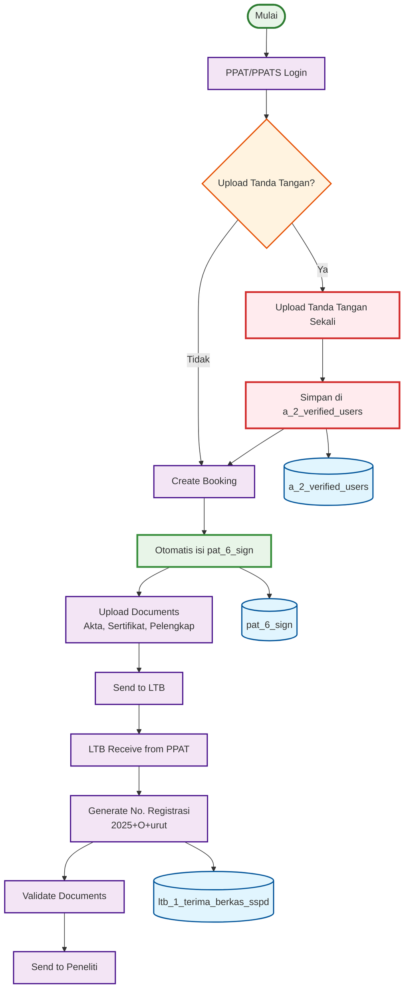

# ACTIVITY DIAGRAM - ITERASI 2 (PART 1)
## PPAT/PPATS → LTB Process dengan Otomasi (Halaman 1)

## WORKFLOW PART 1 - PPAT/PPATS → LTB (ITERASI 2):

### 🎯 **PPAT/PPATS Process (8 langkah):**
1. **PPAT/PPATS Login** - Login ke sistem
2. **Upload Tanda Tangan?** - **🆕 DECISION BARU** - Upload atau tidak
3. **Upload Tanda Tangan Sekali** - **🆕 FITUR BARU** - Upload sekali saja
4. **Simpan di a_2_verified_users** - **🆕 DATABASE BARU** - Simpan path tanda tangan
5. **Create Booking** - Membuat booking baru
6. **Otomatis isi pat_6_sign** - **🤖 OTOMASI** - Otomatis dari a_2_verified_users
7. **Upload Documents** - Upload akta, sertifikat, dokumen pelengkap
8. **Send to LTB** - Kirim ke Loket Terima Berkas

### 🎯 **LTB Process (4 langkah):**
1. **LTB Receive from PPAT** - Terima dari PPAT
2. **Generate No. Registrasi** - Generate nomor registrasi (2025+O+urut)
3. **Validate Documents** - Validasi dokumen
4. **Send to Peneliti** - Kirim ke peneliti

## PERUBAHAN UTAMA ITERASI 2 - PART 1:

### 🆕 **FITUR BARU:**
- **Upload Tanda Tangan Sekali** - Tidak perlu upload berulang
- **Database a_2_verified_users** - Simpan path tanda tangan
- **Decision Point** - Pilih upload atau tidak

### 🤖 **OTOMASI:**
- **Otomatis isi pat_6_sign** - Dari a_2_verified_users
- **Tidak perlu drop gambar** - Otomatis tempel
- **Path permanen** - Tersimpan untuk digunakan otomatis

### 📊 **DATABASE TABLES - PART 1 (3 TABEL):**

#### **🆕 New Tables:**
1. **a_2_verified_users** - **BARU** - User dengan tanda tangan tersimpan

#### **✅ Existing Tables:**
2. **pat_6_sign** - **UPDATED** - Otomatis isi dari a_2_verified_users
3. **ltb_1_terima_berkas_sspd** - **SAMA** - Penerimaan berkas LTB

## KEY FEATURES - PART 1:

### ✅ **Otomasi Tanda Tangan:**
- **Upload Sekali** - Tanda tangan diupload sekali saja
- **Otomatis Tempel** - Otomatis tempel di pat_6_sign
- **Path Permanen** - Path tersimpan di a_2_verified_users
- **Decision Point** - Pilih upload atau tidak

### ✅ **Database Integration:**
- **3 Database Tables** - Terintegrasi dengan proses
- **New Table** - a_2_verified_users untuk tanda tangan
- **Updated Table** - pat_6_sign otomatis isi
- **Real-time Updates** - Update database di setiap tahap

## WORKFLOW SUMMARY - PART 1:

### 📋 **Total Steps: 12 Langkah**
- **PPAT Process**: 8 langkah (termasuk decision)
- **LTB Process**: 4 langkah
- **Database Updates**: 3 tables
- **New Features**: 3 fitur baru
- **Automation**: 1 fitur otomasi

### 📋 **Process Flow:**
- **Sequential**: PPAT → LTB
- **Decision**: PPAT memilih upload tanda tangan
- **Automation**: Otomatis isi pat_6_sign
- **Database**: 3 tables terintegrasi

### 📋 **Perubahan dari Iterasi 1:**
- **🆕 Decision Point** - Upload tanda tangan (Ya/Tidak)
- **🆕 New Database** - a_2_verified_users
- **🤖 Automation** - Otomatis isi pat_6_sign
- **📊 Efficiency** - Tidak perlu upload berulang
