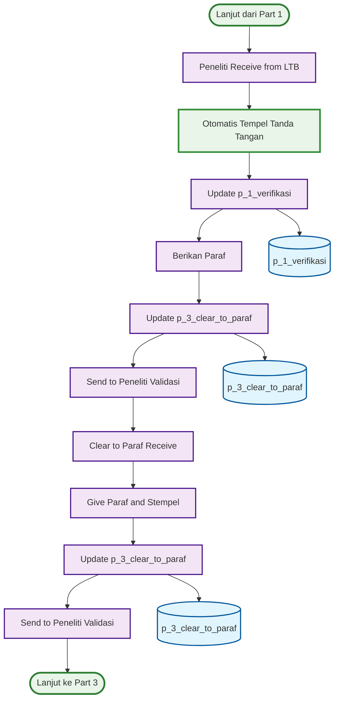

# ACTIVITY DIAGRAM - ITERASI 2 (PART 2)
## Peneliti → Clear to Paraf Process dengan Otomasi (Halaman 2)

## WORKFLOW PART 2 - PENELITI → CLEAR TO PARAF (ITERASI 2):

### 🎯 **Peneliti Process (6 langkah):**
1. **Peneliti Receive from LTB** - Terima dari LTB
2. **Otomatis Tempel Tanda Tangan** - **🤖 OTOMASI** - Otomatis dari a_2_verified_users
3. **Update p_1_verifikasi** - Update database verifikasi
4. **Berikan Paraf** - Berikan paraf
5. **Update p_3_clear_to_paraf** - Update database clear to paraf
6. **Send to Peneliti Validasi** - Kirim ke peneliti validasi

### 🎯 **Clear to Paraf Process (4 langkah):**
1. **Clear to Paraf Receive** - Terima dari peneliti
2. **Give Paraf and Stempel** - Berikan paraf dan stempel
3. **Update p_3_clear_to_paraf** - Update database clear to paraf
4. **Send to Peneliti Validasi** - Kirim ke peneliti validasi

## PERUBAHAN UTAMA ITERASI 2 - PART 2:

### 🤖 **OTOMASI:**
- **Otomatis Tempel Tanda Tangan** - Tidak perlu drop gambar manual
- **Dari a_2_verified_users** - Menggunakan path yang tersimpan
- **Efisiensi Waktu** - Proses lebih cepat

### 📊 **DATABASE TABLES - PART 2 (2 TABEL):**

#### **✅ Updated Tables:**
1. **p_1_verifikasi** - **UPDATED** - Tambah kolom tanda_tangan_path dan ttd_peneliti_mime
2. **p_3_clear_to_paraf** - **UPDATED** - Tambah kolom ttd_paraf_mime dan tanda_paraf_path

## KEY FEATURES - PART 2:

### ✅ **Otomasi Tanda Tangan:**
- **Otomatis Tempel** - Tidak perlu drop gambar manual
- **Path Permanen** - Menggunakan path dari a_2_verified_users
- **Efisiensi** - Proses lebih cepat dan konsisten

### ✅ **Database Integration:**
- **2 Database Tables** - Terintegrasi dengan proses
- **Updated Columns** - Tambah kolom untuk tanda tangan
- **Real-time Updates** - Update database di setiap tahap

### ✅ **Process Efficiency:**
- **Manual Process** - Berikan paraf dan stempel
- **Automation** - Tanda tangan otomatis
- **Consistency** - Tanda tangan konsisten

## WORKFLOW SUMMARY - PART 2:

### 📋 **Total Steps: 10 Langkah**
- **Peneliti Process**: 6 langkah
- **Clear to Paraf Process**: 4 langkah
- **Database Updates**: 2 tables
- **Automation**: 1 fitur otomasi

### 📋 **Process Flow:**
- **Sequential**: Peneliti → Clear to Paraf
- **Automation**: Otomatis tempel tanda tangan
- **Database**: 2 tables terintegrasi
- **Continuation**: Lanjut ke Part 3

### 📋 **Perubahan dari Iterasi 1:**
- **🤖 Automation** - Otomatis tempel tanda tangan
- **📊 Database Updates** - Tambah kolom untuk tanda tangan
- **⚡ Efficiency** - Proses lebih cepat
- **🎯 Consistency** - Tanda tangan konsisten

### 📋 **Efisiensi yang Dicapai:**
- **Tidak perlu drop gambar** - Otomatis tempel
- **Path permanen** - Menggunakan path tersimpan
- **Proses lebih cepat** - Tidak ada manual drop
- **Konsistensi** - Tanda tangan sama di semua dokumen
