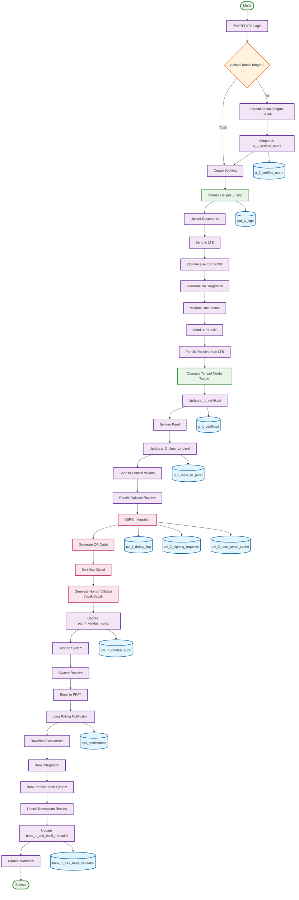

# ACTIVITY DIAGRAM - ITERASI 2
## Otomasi Tanda Tangan dan BSRE Integration (Maret - Agustus 2025)

## WORKFLOW ITERASI 2 - ACTIVITY DIAGRAM:

### 🎯 **Tahap 1: PPAT/PPATS - Upload Tanda Tangan Sekali**
1. **PPAT/PPATS Login** - Login ke sistem
2. **Upload Tanda Tangan?** - Decision: Upload atau tidak
3. **Upload Tanda Tangan Sekali** - Upload tanda tangan (jika ya)
4. **Simpan di a_2_verified_users** - Simpan path tanda tangan
5. **Create Booking** - Membuat booking baru
6. **Otomatis isi pat_6_sign** - Otomatis isi dari a_2_verified_users
7. **Upload Documents** - Upload dokumen
8. **Send to LTB** - Kirim ke LTB

### 🎯 **Tahap 2: LTB Process (Sama seperti Iterasi 1)**
1. **LTB Receive from PPAT** - Terima dari PPAT
2. **Generate No. Registrasi** - Generate nomor registrasi
3. **Validate Documents** - Validasi dokumen
4. **Send to Peneliti** - Kirim ke peneliti

### 🎯 **Tahap 3: Peneliti - Otomasi Tanda Tangan**
1. **Peneliti Receive from LTB** - Terima dari LTB
2. **Otomatis Tempel Tanda Tangan** - Otomatis dari a_2_verified_users
3. **Update p_1_verifikasi** - Update database verifikasi
4. **Berikan Paraf** - Berikan paraf
5. **Update p_3_clear_to_paraf** - Update database clear to paraf
6. **Send to Peneliti Validasi** - Kirim ke peneliti validasi

### 🎯 **Tahap 4: Peneliti Validasi - BSRE Integration**
1. **Peneliti Validasi Receive** - Terima dari peneliti
2. **BSRE Integration** - Integrasi dengan BSRE
3. **Generate QR Code** - Generate QR code
4. **Sertifikat Digital** - Generate sertifikat digital
5. **Generate Nomor Validasi** - Generate nomor validasi (7acak-3acak)
6. **Update pat_7_validasi_surat** - Update database validasi surat
7. **Send to System** - Kirim ke sistem

### 🎯 **Tahap 5: System - Notifikasi Real-time**
1. **System Receive** - Terima dari peneliti validasi
2. **Email to PPAT** - Kirim email ke PPAT
3. **Long Polling Notification** - Notifikasi real-time
4. **Download Documents** - Download dokumen via email
5. **Bank Integration** - Integrasi dengan Bank

### 🎯 **Tahap 6: Bank - Workflow Paralel**
1. **Bank Receive from System** - Terima dari sistem
2. **Check Transaction Results** - Cek hasil transaksi
3. **Update bank_1_cek_hasil_transaksi** - Update database bank
4. **Parallel Workflow** - Workflow paralel
5. **Selesai** - Proses selesai

## DATABASE TABLES (10 TABEL):

### 🎯 **New Tables (7 tables):**
1. **a_2_verified_users** - User dengan tanda tangan tersimpan
2. **pv_1_debug_log** - Log debugging BSRE
3. **pv_2_signing_requests** - Request penandatanganan
4. **pv_3_bsre_token_cache** - Cache token BSRE
5. **pat_7_validasi_surat** - Validasi surat dengan nomor validasi
6. **sys_notifications** - Notifikasi sistem
7. **bank_1_cek_hasil_transaksi** - Cek hasil transaksi bank

### 🎯 **Updated Tables (3 tables):**
8. **pat_6_sign** - Otomatis isi dari a_2_verified_users
9. **p_1_verifikasi** - Tambah kolom tanda_tangan_path dan ttd_peneliti_mime
10. **p_3_clear_to_paraf** - Tambah kolom ttd_paraf_mime dan tanda_paraf_path

## KEY FEATURES ITERASI 2:

### ✅ **Otomasi Tanda Tangan:**
- **Upload Sekali** - Tanda tangan diupload sekali saja
- **Otomatis Tempel** - Otomatis tempel di seluruh workflow
- **Path Permanen** - Path tersimpan di a_2_verified_users
- **WP Manual** - Tanda tangan WP tetap manual (opsional)

### ✅ **BSRE Integration:**
- **Autentikasi Digital** - Sertifikat digital
- **QR Code Generation** - Generate QR code
- **Nomor Validasi** - 7acak-3acak untuk tracking
- **Debug Logging** - Log debugging BSRE

### ✅ **Notifikasi Real-time:**
- **Email Otomatis** - Email ke PPAT pembuat
- **Long Polling** - Notifikasi real-time untuk pegawai
- **Download Documents** - Download dokumen via email
- **System Integration** - Integrasi dengan sistem

### ✅ **Bank Integration:**
- **Workflow Paralel** - LTB + Bank parallel
- **Transaction Results** - Cek hasil transaksi
- **Database Integration** - bank_1_cek_hasil_transaksi

## DECISION POINTS:

### 🎯 **PPAT Decision:**
- **Upload Tanda Tangan?** - Ya/Tidak
- **Ya** → Upload dan simpan di a_2_verified_users
- **Tidak** → Langsung ke booking

### 🎯 **Process Flow:**
- **Sequential** - PPAT → LTB → Peneliti → Peneliti Validasi → System → Bank
- **Otomasi** - Tanda tangan otomatis di setiap tahap
- **BSRE Integration** - Integrasi BSRE di peneliti validasi
- **Parallel Workflow** - LTB + Bank parallel

## WORKFLOW SUMMARY:

### 📋 **Total Steps: 25 Langkah**
- **PPAT Process**: 8 langkah (termasuk decision)
- **LTB Process**: 4 langkah
- **Peneliti Process**: 6 langkah
- **Peneliti Validasi**: 7 langkah
- **System Process**: 5 langkah
- **Bank Process**: 5 langkah

### 📋 **Database Updates: 10 Tables**
- **New Tables**: 7 tables
- **Updated Tables**: 3 tables
- **BSRE Integration**: 3 tables
- **Real-time Integration**: Setiap tahap

### 📋 **Automation Features: 3 Main Features**
- **Tanda Tangan Otomatis**: PPAT dan Peneliti
- **BSRE Integration**: Peneliti Validasi
- **Notifikasi Real-time**: System
