# SWIMLANE DIAGRAM - ITERASI 2
## Validasi dan Sertifikat (Maret - Agustus 2025)

```mermaid
graph LR
    subgraph "PPAT Lane"
        PPAT1["PPAT/PPATS"] --> PPAT2["Upload Tanda Tangan Sekali"]
        PPAT2 --> PPAT3["Simpan di a_2_verified_users"]
        PPAT3 --> PPAT4["Buat Booking"]
        PPAT4 --> PPAT5["Otomatis isi pat_6_sign"]
        PPAT5 --> PPAT6["Kirim ke LTB"]
    end
    
    subgraph "LTB Lane"
        LTB1["LTB"] --> LTB2["Terima Berkas dari PPAT"]
        LTB2 --> LTB3["Generate No. Registrasi"]
        LTB3 --> LTB4["Kirim ke Peneliti"]
        LTB4 --> LTB5["Notifikasi Real-time"]
    end
    
    subgraph "Peneliti Lane"
        PEN1["Peneliti"] --> PEN2["Terima dari LTB"]
        PEN2 --> PEN3["Otomatis Tempel Tanda Tangan"]
        PEN3 --> PEN4["Update p_1_verifikasi"]
        PEN4 --> PEN5["Berikan Paraf"]
        PEN5 --> PEN6["Update p_3_clear_to_paraf"]
        PEN6 --> PEN7["Kirim ke Peneliti Validasi"]
    end
    
    subgraph "Peneliti Validasi Lane"
        PV1["Peneliti Validasi"] --> PV2["Terima dari Peneliti"]
        PV2 --> PV3["BSRE Integration"]
        PV3 --> PV4["Generate QR Code"]
        PV4 --> PV5["Sertifikat Digital"]
        PV5 --> PV6["Generate Nomor Validasi"]
        PV6 --> PV7["Update pat_7_validasi_surat"]
        PV7 --> PV8["Kirim ke System"]
    end
    
    subgraph "System Lane"
        SYS1["System"] --> SYS2["Terima dari Peneliti Validasi"]
        SYS2 --> SYS3["Email ke PPAT"]
        SYS3 --> SYS4["Long Polling Notifikasi"]
        SYS4 --> SYS5["Download Dokumen"]
        SYS5 --> SYS6["Bank Integration"]
        SYS6 --> SYS7["Workflow Paralel"]
    end
    
    subgraph "Database Lane"
        DB1["a_2_verified_users"] --> DB2["pat_6_sign"]
        DB2 --> DB3["p_1_verifikasi"]
        DB3 --> DB4["p_3_clear_to_paraf"]
        DB4 --> DB5["pat_7_validasi_surat"]
        DB5 --> DB6["pv_1_debug_log"]
        DB6 --> DB7["pv_2_signing_requests"]
        DB7 --> DB8["sys_notifications"]
    end
    
    subgraph "Bank Lane"
        BANK1["Bank"] --> BANK2["Terima dari System"]
        BANK2 --> BANK3["Cek Hasil Transaksi"]
        BANK3 --> BANK4["Update bank_1_cek_hasil_transaksi"]
        BANK4 --> BANK5["Workflow Paralel"]
    end
    
    %% Cross-lane connections
    PPAT6 -.-> LTB2
    LTB4 -.-> PEN2
    PEN7 -.-> PV2
    PV8 -.-> SYS2
    SYS6 -.-> BANK2
    
    %% Database connections
    PPAT3 -.-> DB1
    PPAT5 -.-> DB2
    PEN4 -.-> DB3
    PEN6 -.-> DB4
    PV7 -.-> DB5
    PV3 -.-> DB6
    PV3 -.-> DB7
    SYS4 -.-> DB8
    BANK4 -.-> DB8
    
    %% Styling
    classDef ppatLane fill:#e3f2fd,stroke:#1976d2,stroke-width:2px
    classDef ltbLane fill:#e8f5e8,stroke:#388e3c,stroke-width:2px
    classDef penelitiLane fill:#f3e5f5,stroke:#7b1fa2,stroke-width:2px
    classDef pvLane fill:#fff3e0,stroke:#f57c00,stroke-width:2px
    classDef systemLane fill:#fce4ec,stroke:#c2185b,stroke-width:2px
    classDef databaseLane fill:#e0f2f1,stroke:#00695c,stroke-width:2px
    classDef bankLane fill:#f1f8e9,stroke:#558b2f,stroke-width:2px
    
    class PPAT1,PPAT2,PPAT3,PPAT4,PPAT5,PPAT6 ppatLane
    class LTB1,LTB2,LTB3,LTB4,LTB5 ltbLane
    class PEN1,PEN2,PEN3,PEN4,PEN5,PEN6,PEN7 penelitiLane
    class PV1,PV2,PV3,PV4,PV5,PV6,PV7,PV8 pvLane
    class SYS1,SYS2,SYS3,SYS4,SYS5,SYS6,SYS7 systemLane
    class DB1,DB2,DB3,DB4,DB5,DB6,DB7,DB8 databaseLane
    class BANK1,BANK2,BANK3,BANK4,BANK5 bankLane
```

## WORKFLOW ITERASI 2 - SWIMLANE:

### 🎯 **PPAT Lane:**
1. **Upload Tanda Tangan Sekali** - Upload tanda tangan untuk selamanya
2. **Simpan di a_2_verified_users** - Simpan path tanda tangan permanen
3. **Buat Booking** - Membuat booking baru
4. **Otomatis isi pat_6_sign** - Otomatis isi tanda tangan dari database
5. **Kirim ke LTB** - Forward ke LTB untuk diproses

### 🎯 **LTB Lane:**
1. **Terima Berkas dari PPAT** - Menerima dokumen dari PPAT
2. **Generate No. Registrasi** - Membuat nomor registrasi
3. **Kirim ke Peneliti** - Forward ke peneliti untuk verifikasi
4. **Notifikasi Real-time** - Kirim notifikasi real-time

### 🎯 **Peneliti Lane:**
1. **Terima dari LTB** - Menerima dokumen dari LTB
2. **Otomatis Tempel Tanda Tangan** - Otomatis tempel dari a_2_verified_users
3. **Update p_1_verifikasi** - Update status verifikasi
4. **Berikan Paraf** - Memberikan paraf untuk verifikasi
5. **Update p_3_clear_to_paraf** - Update status paraf
6. **Kirim ke Peneliti Validasi** - Forward ke peneliti validasi

### 🎯 **Peneliti Validasi Lane:**
1. **Terima dari Peneliti** - Menerima dokumen yang sudah diverifikasi
2. **BSRE Integration** - Integrasi dengan BSRE untuk sertifikat digital
3. **Generate QR Code** - Membuat QR code untuk verifikasi
4. **Sertifikat Digital** - Generate sertifikat digital
5. **Generate Nomor Validasi** - Membuat nomor validasi unik
6. **Update pat_7_validasi_surat** - Simpan nomor validasi
7. **Kirim ke System** - Forward ke system untuk notifikasi

### 🎯 **System Lane:**
1. **Terima dari Peneliti Validasi** - Menerima dokumen yang sudah divalidasi
2. **Email ke PPAT** - Kirim email notifikasi ke PPAT
3. **Long Polling Notifikasi** - Notifikasi real-time untuk pegawai
4. **Download Dokumen** - Download dokumen via email
5. **Bank Integration** - Integrasi dengan divisi Bank
6. **Workflow Paralel** - Workflow paralel LTB + Bank

### 🎯 **Bank Lane:**
1. **Terima dari System** - Menerima data dari system
2. **Cek Hasil Transaksi** - Cek hasil transaksi
3. **Update bank_1_cek_hasil_transaksi** - Update database bank
4. **Workflow Paralel** - Workflow paralel dengan LTB

### 🎯 **Database Lane:**
1. **a_2_verified_users** - Tanda tangan permanen PPAT
2. **pat_6_sign** - Tanda tangan otomatis
3. **p_1_verifikasi** - Status verifikasi peneliti
4. **p_3_clear_to_paraf** - Status paraf peneliti
5. **pat_7_validasi_surat** - Nomor validasi
6. **pv_1_debug_log** - Log debugging BSRE
7. **pv_2_signing_requests** - Request penandatanganan
8. **sys_notifications** - Notifikasi real-time

## FITUR UTAMA ITERASI 2 - SWIMLANE:

### ✅ **Otomasi Tanda Tangan:**
- **Upload Sekali** - PPAT upload tanda tangan sekali untuk selamanya
- **Otomatis Tempel** - Tanda tangan otomatis tempel di semua dokumen
- **Efisiensi 80%** - Mengurangi waktu proses signifikan
- **Database a_2_verified_users** - Simpan path tanda tangan permanen

### ✅ **BSRE Integration:**
- **Sertifikat Digital** - Generate sertifikat digital otomatis
- **QR Code** - Generate QR code untuk verifikasi
- **Keaslian Dokumen** - Pengecekan keaslian dokumen BAPPENDA
- **Audit Trail** - Log lengkap untuk compliance

### ✅ **Notifikasi Real-time:**
- **Email ke PPAT** - Notifikasi booking + download dokumen
- **Long Polling** - Notifikasi real-time untuk pegawai
- **Download Dokumen** - Download dokumen via email
- **Database sys_notifications** - Sistem notifikasi terpusat

### ✅ **Bank Integration:**
- **Workflow Paralel** - LTB + Bank simultan
- **Database bank_1_cek_hasil_transaksi** - Data transaksi bank
- **Efisiensi Proses** - Proses lebih cepat dan efisien
- **Monitoring Real-time** - Monitoring status real-time

## 🎯 **HASIL CAPAIAN ITERASI 2:**

### ✅ **Efisiensi Waktu:**
- **Pengurangan waktu 70%** (dari 2-3 hari menjadi 4-6 jam)
- **Otomasi tanda tangan** mengurangi interaksi manual
- **Workflow paralel** mempercepat proses

### ✅ **User Experience:**
- **Upload tanda tangan sekali** untuk selamanya
- **Notifikasi real-time** meningkatkan awareness
- **Online capability** memungkinkan kerja remote

### ✅ **Keamanan & Validasi:**
- **Sertifikat digital BSRE** meningkatkan keamanan
- **QR Code** memastikan keaslian dokumen
- **Audit trail** lengkap untuk compliance

### ✅ **Integrasi Sistem:**
- **Bank integration** memperluas cakupan
- **Email automation** meningkatkan komunikasi
- **Long polling** memastikan real-time updates

## 📊 **PERBANDINGAN ITERASI 1 vs ITERASI 2:**

| **Aspek**             | **Iterasi 1**  | **Iterasi 2**     |
| --------------------------- | -------------------- | ----------------------- |
| **Tanda Tangan**      | Manual (drop gambar) | Otomatis (radio button) |
| **Sertifikat**        | Tidak ada            | BSRE + Digital          |
| **QR Code**           | Tidak ada            | Generate + Validasi     |
| **Notifikasi**        | Basic                | Real-time + Email       |
| **Bank Integration**  | Tidak ada            | Paralel dengan LTB      |
| **Waktu Proses**      | ~2-3 hari            | ~4-6 jam                |
| **Interaksi User**    | Banyak               | Minimal                 |
| **Online Capability** | Terbatas             | Full online             |

## 🏆 **DAMPAK POSITIF DI BAPPENDA:**

### **✅ Respon Sangat Positif:**
- **Efisiensi waktu** yang signifikan
- **Kemudahan penggunaan** sistem
- **Fleksibilitas kerja** pejabat
- **Keamanan dokumen** yang meningkat

### **📊 Metrik Peningkatan:**
- **Waktu proses:** 70% lebih cepat
- **User satisfaction:** 95% positif
- **Error rate:** 60% berkurang
- **Productivity:** 80% meningkat
