# USE CASE DIAGRAM - ITERASI 2
## Validasi dan Sertifikat (Maret - Agustus 2025)

```mermaid
graph TB
    %% Actors
    PPAT["PPAT/PPATS"]
    LTB["Loket Terima Berkas"]
    Peneliti["Peneliti"]
    PenelitiValidasi["Peneliti Validasi"]
    System["System"]
    Bank["Bank"]
    Admin["Admin"]

    %% Use Cases - PPAT Process
    PPAT --> UC1["1. Upload Tanda Tangan Sekali"]
    PPAT --> UC2["2. Create Booking"]
    PPAT --> UC3["3. Auto Fill Signature"]
    UC1 --> DB1[("a_2_verified_users")]
    UC3 --> DB2[("pat_6_sign")]
    
    %% LTB Process
    LTB --> UC4["4. Receive from PPAT"]
    LTB --> UC5["5. Generate No. Registrasi"]
    LTB --> UC6["6. Send to Peneliti"]
    UC4 --> DB3[("ltb_1_terima_berkas_sspd")]
    
    %% Peneliti Process
    Peneliti --> UC7["7. Receive from LTB"]
    Peneliti --> UC8["8. Auto Tempel Tanda Tangan"]
    Peneliti --> UC9["9. Give Paraf"]
    UC8 --> DB4[("p_1_verifikasi")]
    UC9 --> DB5[("p_3_clear_to_paraf")]
    
    %% Peneliti Validasi Process
    PenelitiValidasi --> UC10["10. Receive from Peneliti"]
    PenelitiValidasi --> UC11["11. BSRE Integration"]
    PenelitiValidasi --> UC12["12. Generate QR Code"]
    PenelitiValidasi --> UC13["13. Digital Certificate"]
    PenelitiValidasi --> UC14["14. Generate Nomor Validasi"]
    UC11 --> DB6[("pv_1_debug_log")]
    UC11 --> DB7[("pv_2_signing_requests")]
    UC11 --> DB8[("pv_3_bsre_token_cache")]
    UC14 --> DB9[("pat_7_validasi_surat")]
    
    %% System Process
    System --> UC15["15. Email to PPAT"]
    System --> UC16["16. Long Polling Notification"]
    System --> UC17["17. Download Documents"]
    System --> UC18["18. Bank Integration"]
    UC15 --> DB10[("sys_notifications")]
    UC16 --> DB10
    UC18 --> DB11[("bank_1_cek_hasil_transaksi")]
    
    %% Bank Process
    Bank --> UC19["19. Receive from System"]
    Bank --> UC20["20. Check Transaction Results"]
    Bank --> UC21["21. Parallel Workflow"]
    
    %% Admin Process
    Admin --> UC22["22. Monitor Process"]
    Admin --> UC23["23. Quality Control"]
    Admin --> UC24["24. Generate Reports"]
    
    %% Styling
    classDef actor fill:#e1f5fe,stroke:#01579b,stroke-width:2px
    classDef usecase fill:#f3e5f5,stroke:#4a148c,stroke-width:2px
    classDef database fill:#e8f5e8,stroke:#2e7d32,stroke-width:2px
    
    class PPAT,LTB,Peneliti,PenelitiValidasi,System,Bank,Admin actor
    class UC1,UC2,UC3,UC4,UC5,UC6,UC7,UC8,UC9,UC10,UC11,UC12,UC13,UC14,UC15,UC16,UC17,UC18,UC19,UC20,UC21,UC22,UC23,UC24 usecase
    class DB1,DB2,DB3,DB4,DB5,DB6,DB7,DB8,DB9,DB10,DB11 database
```

## FITUR UTAMA ITERASI 2:

### 🎯 **PPAT Process:**
- **Upload Tanda Tangan Sekali** - Upload tanda tangan untuk selamanya
- **Create Booking** - Membuat booking baru
- **Auto Fill Signature** - Otomatis isi tanda tangan dari database

### 🎯 **LTB Process:**
- **Receive from PPAT** - Terima berkas dari PPAT
- **Generate No. Registrasi** - Generate nomor registrasi
- **Send to Peneliti** - Kirim ke peneliti untuk verifikasi

### 🎯 **Peneliti Process:**
- **Receive from LTB** - Terima dari LTB
- **Auto Tempel Tanda Tangan** - Otomatis tempel dari a_2_verified_users
- **Give Paraf** - Berikan paraf untuk verifikasi

### 🎯 **Peneliti Validasi Process:**
- **Receive from Peneliti** - Terima dari peneliti
- **BSRE Integration** - Integrasi dengan BSRE untuk sertifikat digital
- **Generate QR Code** - Generate QR code untuk verifikasi
- **Digital Certificate** - Generate sertifikat digital
- **Generate Nomor Validasi** - Generate nomor validasi (7acak+(-)+3acak)

### 🎯 **System Process:**
- **Email to PPAT** - Kirim email notifikasi ke PPAT
- **Long Polling Notification** - Notifikasi real-time untuk pegawai
- **Download Documents** - Download dokumen via email
- **Bank Integration** - Integrasi dengan divisi Bank

### 🎯 **Bank Process:**
- **Receive from System** - Terima data dari system
- **Check Transaction Results** - Cek hasil transaksi
- **Parallel Workflow** - Workflow paralel dengan LTB

### 🎯 **Admin Process:**
- **Monitor Process** - Monitoring seluruh proses
- **Quality Control** - Kontrol kualitas
- **Generate Reports** - Membuat laporan

## DATABASE TABLES BARU:

1. **a_2_verified_users** - Tanda tangan permanen PPAT
2. **pv_1_debug_log** - Log debugging BSRE
3. **pv_2_signing_requests** - Request penandatanganan
4. **pv_3_bsre_token_cache** - Cache token BSRE
5. **pat_7_validasi_surat** - Nomor validasi
6. **sys_notifications** - Notifikasi real-time
7. **bank_1_cek_hasil_transaksi** - Data transaksi bank

## WORKFLOW ITERASI 2:

### 📋 **Step 1: Otomasi Tanda Tangan**
1. PPAT upload tanda tangan sekali
2. Simpan di a_2_verified_users
3. Auto fill signature di pat_6_sign

### 📋 **Step 2: BSRE Integration**
1. Peneliti Validasi terima dari peneliti
2. BSRE integration untuk sertifikat digital
3. Generate QR code dan digital certificate
4. Generate nomor validasi

### 📋 **Step 3: Notifikasi Real-time**
1. System kirim email ke PPAT
2. Long polling notification untuk pegawai
3. Download dokumen via email

### 📋 **Step 4: Bank Integration**
1. Bank terima data dari system
2. Check transaction results
3. Parallel workflow dengan LTB
