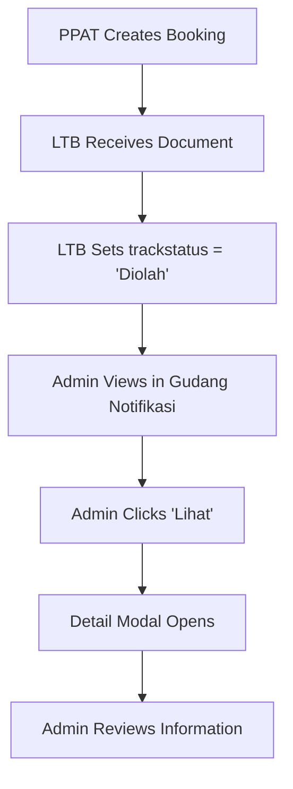

# 🏪 Gudang Notifikasi - PPAT → LTB Implementation

## 📋 Overview

Gudang Notifikasi adalah sistem monitoring notifikasi berbasis tabel yang memungkinkan admin untuk melihat dan mengelola notifikasi berdasarkan alur kerja (workflow) sistem. Implementasi pertama fokus pada segmen **PPAT → LTB** dengan trackstatus 'Diolah'.

## 🎯 Segmen PPAT → LTB

### **Definisi:**
- **PPAT** mengirim dokumen ke **LTB** (Loket Terima Berkas)
- **Trackstatus:** 'Diolah' - menandakan dokumen sedang diproses oleh LTB
- **Status:** Dokumen telah diterima LTB dan sedang dalam tahap pengolahan

### **Data Source:**
```sql
SELECT 
    b.bookingid,
    b.nobooking,
    b.userid,
    b.namawajibpajak,
    b.jenis_wajib_pajak,
    b.noppbb,
    u.nama as ppat_nama,
    u.divisi as ppat_divisi,
    u.ppatk_khusus,
    ltb.status as ltb_status,
    ltb.trackstatus as ltb_trackstatus,
    ltb.updated_at as ltb_updated_at,
    ltb.nama_pengirim as ltb_pengirim
FROM pat_1_bookingsspd b
JOIN a_2_verified_users u ON b.userid = u.userid
LEFT JOIN ltb_1_terima_berkas_sspd ltb ON b.nobooking = ltb.nobooking
WHERE ltb.trackstatus = 'Diolah'
```

## 🔧 Backend Implementation

### **File:** `backend/routesxcontroller/4_admin/notification_warehouse_routes.js`

#### **Endpoints:**

##### 1. **GET /api/admin/notification-warehouse/ppat-ltb**
- **Purpose:** Get PPAT → LTB notifications with trackstatus 'Diolah'
- **Parameters:**
  - `page` (optional): Page number (default: 1)
  - `limit` (optional): Items per page (default: 50)
  - `search` (optional): Search term for NoBooking/UserID/WP
- **Response:**
```json
{
  "success": true,
  "data": [
    {
      "bookingid": 123,
      "nobooking": "NB-001",
      "userid": "USR21",
      "ppat_nama": "John Doe",
      "ppat_divisi": "PPAT",
      "ppatk_khusus": "Ya",
      "namawajibpajak": "PT Example",
      "jenis_wajib_pajak": "PBB",
      "noppbb": "NP-1001",
      "ltb_status": "Diterima",
      "ltb_trackstatus": "Diolah",
      "ltb_pengirim": "LTB Staff",
      "created_at": "2025-01-15T10:00:00Z",
      "updated_at": "2025-01-15T11:30:00Z"
    }
  ],
  "pagination": {
    "page": 1,
    "limit": 50,
    "total": 25,
    "totalPages": 1
  }
}
```

##### 2. **GET /api/admin/notification-warehouse/ppat-ltb/:bookingId**
- **Purpose:** Get detailed information for specific notification
- **Response:**
```json
{
  "success": true,
  "data": {
    "bookingid": 123,
    "nobooking": "NB-001",
    "userid": "USR21",
    "ppat_nama": "John Doe",
    "ppat_divisi": "PPAT",
    "ppatk_khusus": "Ya",
    "namawajibpajak": "PT Example",
    "jenis_wajib_pajak": "PBB",
    "noppbb": "NP-1001",
    "ltb_status": "Diterima",
    "ltb_trackstatus": "Diolah",
    "ltb_pengirim": "LTB Staff",
    "ltb_catatan": "Dokumen lengkap, siap diproses",
    "created_at": "2025-01-15T10:00:00Z",
    "updated_at": "2025-01-15T11:30:00Z"
  }
}
```

##### 3. **GET /api/admin/notification-warehouse/stats**
- **Purpose:** Get notification statistics for all segments
- **Response:**
```json
{
  "success": true,
  "data": {
    "ppat_ltb": 25,
    "ltb_lsb": 15,
    "lsb_ppat": 8
  }
}
```

### **Security:**
- **Admin Only:** All endpoints require admin authentication
- **Session Validation:** Uses `verifyAdmin` middleware
- **Divisi Check:** Only Administrator/Admin/A divisi can access

## 🎨 Frontend Implementation

### **File:** `public/admin-status-ppat.html`

#### **Features:**

##### 1. **Segmented Control**
```html
<div class="segmented" role="tablist" aria-label="Kategori Notifikasi">
  <button class="seg-btn" data-cat="ppat_ltb" aria-pressed="true">PPAT → LTB</button>
  <button class="seg-btn" data-cat="ltb_lsb" aria-pressed="false">LTB → LSB</button>
  <button class="seg-btn" data-cat="lsb_ppat" aria-pressed="false">LSB → PPAT</button>
</div>
```

##### 2. **Search Functionality**
- **Real-time search** across NoBooking, UserID, Nama WP
- **Debounced input** untuk performa optimal
- **Clear search** button

##### 3. **Data Table**
| Column | Description | Source |
|--------|-------------|---------|
| NoBooking | Nomor booking | `b.nobooking` |
| UserID | ID pengguna PPAT | `b.userid` |
| Special Field | Divisi PPAT | `u.divisi` |
| PPATK Khusus | Status khusus PPAT | `u.ppatk_khusus` |
| NOPPBB | Nomor PPBB | `b.noppbb` |
| Jenis WP | Jenis wajib pajak | `b.jenis_wajib_pajak` |
| Updated | Tanggal update | `ltb.updated_at` |
| Aksi | Action button | - |

##### 4. **Detail Modal**
- **Comprehensive information** display
- **Status badges** dengan color coding
- **Responsive design** dengan grid layout
- **Document viewer** integration (TODO)

## 🚀 Usage Flow

### **1. Admin Access**
1. Login sebagai Administrator
2. Navigate ke `/admin-status-ppat.html`
3. Gudang Notifikasi panel akan muncul

### **2. View PPAT → LTB Notifications**
1. Click tab **"PPAT → LTB"** (default active)
2. System loads data dari backend dengan trackstatus 'Diolah'
3. Table displays notifications dengan loading indicator

### **3. Search & Filter**
1. Type di search box untuk filter data
2. Real-time filtering across multiple fields
3. Clear search untuk reset filter

### **4. View Details**
1. Click **"Lihat"** button pada row
2. Modal opens dengan detail lengkap
3. View status, timestamps, dan catatan
4. Access document viewer (future feature)

## 📊 Data Flow



## 🔍 Console Logging

### **Backend Logs:**
```javascript
🔍 [ADMIN] Fetching PPAT → LTB notifications, page: 1, limit: 50, search: ""
🔍 [ADMIN] Executing query: SELECT ...
🔍 [ADMIN] Query params: []
✅ [ADMIN] Found 25 PPAT → LTB notifications (total: 25)
```

### **Frontend Logs:**
```javascript
🔍 Loading notifications for category: ppat_ltb
🔍 Fetching from URL: /api/admin/notification-warehouse/ppat-ltb?page=1&limit=50
✅ Loaded 25 notifications for ppat_ltb
🔍 Opening detail for: {nobooking: "NB-001", bookingId: "123"}
```

## 🛠️ Configuration

### **Backend Configuration:**
```javascript
// Pagination settings
const page = parseInt(req.query.page) || 1;
const limit = parseInt(req.query.limit) || 50;

// Search fields
const searchFields = [
  'b.nobooking',
  'b.userid', 
  'u.nama',
  'b.namawajibpajak',
  'b.noppbb'
];
```

### **Frontend Configuration:**
```javascript
// Default category
let currentCategory = 'ppat_ltb';

// API endpoints
const API_ENDPOINTS = {
  ppat_ltb: '/api/admin/notification-warehouse/ppat-ltb',
  ltb_lsb: '/api/admin/status-ppat/notifications', // TODO
  lsb_ppat: '/api/admin/status-ppat/notifications'  // TODO
};
```

## 🔮 Future Enhancements

### **Phase 2: LTB → LSB**
- Implement LTB → LSB notifications
- Track status: 'Diterima' dan 'Dilanjutkan'
- Integration dengan Peneliti workflow

### **Phase 3: LSB → PPAT**
- Implement LSB → PPAT notifications  
- Track status: 'Terselesaikan'
- Final document delivery tracking

### **Phase 4: Advanced Features**
- **Real-time updates** dengan WebSocket
- **Bulk actions** untuk multiple notifications
- **Export functionality** untuk reporting
- **Advanced filtering** dengan date ranges
- **Document preview** integration

## 🧪 Testing

### **Manual Testing:**
1. **Access Test:** Login sebagai admin dan akses halaman
2. **Data Load Test:** Verify PPAT → LTB data loads correctly
3. **Search Test:** Test search functionality dengan berbagai terms
4. **Detail Test:** Click "Lihat" dan verify modal opens
5. **Error Test:** Test dengan invalid data atau network errors

### **API Testing:**
```bash
# Test PPAT → LTB endpoint
curl -X GET "http://localhost:3000/api/admin/notification-warehouse/ppat-ltb?page=1&limit=10" \
  -H "Cookie: connect.sid=your_session_cookie"

# Test search
curl -X GET "http://localhost:3000/api/admin/notification-warehouse/ppat-ltb?search=NB-001" \
  -H "Cookie: connect.sid=your_session_cookie"

# Test detail
curl -X GET "http://localhost:3000/api/admin/notification-warehouse/ppat-ltb/123" \
  -H "Cookie: connect.sid=your_session_cookie"
```

## 📝 Notes

### **Current Status:**
- ✅ **PPAT → LTB** fully implemented
- ⏳ **LTB → LSB** pending implementation
- ⏳ **LSB → PPAT** pending implementation

### **Dependencies:**
- Admin authentication system
- Database tables: `pat_1_bookingsspd`, `a_2_verified_users`, `ltb_1_terima_berkas_sspd`
- Session management
- Error handling system

### **Performance Considerations:**
- **Pagination** untuk large datasets
- **Indexed queries** pada database
- **Debounced search** untuk UX
- **Loading indicators** untuk feedback

**Gudang Notifikasi PPAT → LTB berhasil diimplementasikan dengan fitur lengkap untuk monitoring dan manajemen notifikasi!** 🎉
