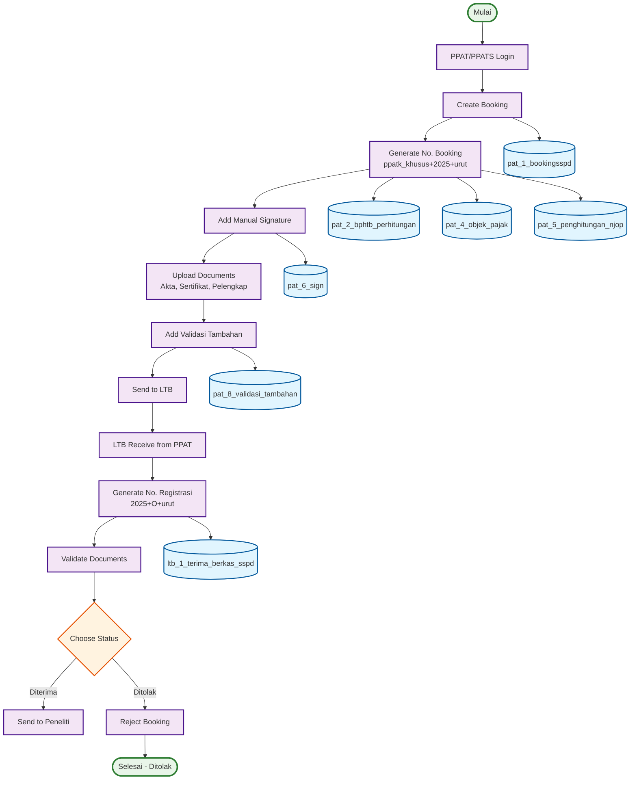

# ACTIVITY DIAGRAM - ITERASI 1 (PART 1)
## PPAT/PPATS → LTB Process (Halaman 1)

## WORKFLOW PART 1 - PPAT/PPATS → LTB:

### 🎯 **PPAT/PPATS Process (7 langkah):**
1. **PPAT/PPATS Login** - Login ke sistem
2. **Create Booking** - Membuat booking baru
3. **Generate No. Booking** - Generate nomor booking (ppatk_khusus+2025+urut)
4. **Add Manual Signature** - Tambahkan tanda tangan manual
5. **Upload Documents** - Upload akta, sertifikat, dokumen pelengkap
6. **Add Validasi Tambahan** - Tambahkan validasi tambahan
7. **Send to LTB** - Kirim ke Loket Terima Berkas

### 🎯 **LTB Process (6 langkah):**
1. **LTB Receive from PPAT** - Terima dari PPAT
2. **Generate No. Registrasi** - Generate nomor registrasi (2025+O+urut)
3. **Validate Documents** - Validasi dokumen
4. **Choose Status** - Pilih status (Diterima/Ditolak)
5. **Send to Peneliti** - Kirim ke peneliti (jika diterima)
6. **Reject Booking** - Tolak booking (jika ditolak)

## DATABASE TABLES - PART 1 (7 TABEL):

### 🎯 **Booking Tables:**
1. **pat_1_bookingsspd** - Data booking utama
2. **pat_2_bphtb_perhitungan** - Perhitungan BPHTB
3. **pat_4_objek_pajak** - Data objek pajak
4. **pat_5_penghitungan_njop** - Perhitungan NJOP
5. **pat_6_sign** - Tanda tangan PPAT dan WP
6. **pat_8_validasi_tambahan** - Validasi tambahan

### 🎯 **Process Tables:**
7. **ltb_1_terima_berkas_sspd** - Penerimaan berkas LTB

## KEY FEATURES - PART 1:

### ✅ **PPAT Features:**
- **Manual Signature** - Tanda tangan manual PPAT
- **Document Upload** - Upload dokumen lengkap
- **Validation** - Validasi tambahan
- **Booking Generation** - Generate nomor booking

### ✅ **LTB Features:**
- **Document Validation** - Validasi dokumen
- **Status Decision** - Pilih diterima/ditolak
- **Registration** - Generate nomor registrasi
- **Process Control** - Kontrol proses

### ✅ **Database Integration:**
- **7 Database Tables** - Terintegrasi dengan proses
- **Real-time Updates** - Update database di setiap tahap
- **Status Management** - Management status booking

## WORKFLOW SUMMARY - PART 1:

### 📋 **Total Steps: 13 Langkah**
- **PPAT Process**: 7 langkah
- **LTB Process**: 6 langkah (termasuk decision)
- **Database Updates**: 7 tables
- **Decision Point**: 1 (Diterima/Ditolak)

### 📋 **Process Flow:**
- **Sequential**: PPAT → LTB
- **Decision**: LTB memilih Diterima/Ditolak
- **Database**: 7 tables terintegrasi
- **End Points**: 2 (Selesai - Ditolak, Lanjut ke Part 2)
