# USE CASE DIAGRAM - ITERASI 1
## Booking hingga Pengiriman (November 2024 - Januari 2025)

```mermaid
graph TB
    %% Actors
    PPAT[PPAT/PPATS]
    LTB[Loket Terima Berkas]
    Peneliti[Peneliti]
    ClearToParaf[Clear to Paraf]
    PenelitiValidasi[Peneliti Validasi]
    LSB[Loket Serah Berkas]
    Admin[Admin]

    %% Use Cases - Booking Process
    PPAT --> UC1[1. Create Booking]
    PPAT --> UC2[2. Generate No. Booking]
    PPAT --> UC3[3. Add Manual Signature]
    PPAT --> UC4[4. Upload Documents]
    PPAT --> UC5[5. Add Validasi Tambahan]
    
    %% Database Tables - Booking
    UC1 --> DB1[("pat_1_bookingsspd")]
    UC2 --> DB2[("pat_2_bphtb_perhitungan")]
    UC2 --> DB3[("pat_4_objek_pajak")]
    UC2 --> DB4[("pat_5_penghitungan_njop")]
    UC3 --> DB5[("pat_6_sign")]
    UC5 --> DB6[("pat_8_validasi_tambahan")]
    
    %% LTB Process
    LTB --> UC6[6. Receive from PPAT]
    LTB --> UC7[7. Generate No. Registrasi]
    LTB --> UC8[8. Validate Documents]
    LTB --> UC9[9. Choose: Diterima/Ditolak]
    UC6 --> DB7[("ltb_1_terima_berkas_sspd")]
    
    %% Peneliti Process
    Peneliti --> UC10[10. Receive from LTB]
    Peneliti --> UC11[11. Verify Documents]
    Peneliti --> UC12[12. Add Manual Signature]
    Peneliti --> UC13[13. Drop Gambar Tanda Tangan]
    UC12 --> DB8[("p_2_verif_sign")]
    UC11 --> DB9[("p_1_verifikasi")]
    
    %% Clear to Paraf Process
    ClearToParaf --> UC14[14. Receive from Peneliti]
    ClearToParaf --> UC15[15. Give Paraf and Stempel]
    UC15 --> DB10[("p_3_clear_to_paraf")]
    
    %% Peneliti Validasi Process
    PenelitiValidasi --> UC16[16. Receive from Clear to Paraf]
    PenelitiValidasi --> UC17[17. Final Validation]
    PenelitiValidasi --> UC18[18. Manual Signature]
    PenelitiValidasi --> UC19[19. Drop Gambar Tanda Tangan]
    UC17 --> DB11[("pv_1_paraf_validate")]
    
    %% LSB Process
    LSB --> UC20[20. Receive from Peneliti Validasi]
    LSB --> UC21[21. Manual Handover]
    LSB --> UC22[22. Update Status]
    UC21 --> DB12[("lsb_1_serah_berkas")]
    UC22 --> DB1
    
    %% Admin Process
    Admin --> UC23[23. Monitor Process]
    Admin --> UC24[24. Send Ping Notifications]
    
    %% Styling
    classDef actor fill:#e1f5fe,stroke:#01579b,stroke-width:2px
    classDef usecase fill:#f3e5f5,stroke:#4a148c,stroke-width:2px
    classDef database fill:#e8f5e8,stroke:#2e7d32,stroke-width:2px
    
    class PPAT,LTB,Peneliti,ClearToParaf,PenelitiValidasi,LSB,Admin actor
    class UC1,UC2,UC3,UC4,UC5,UC6,UC7,UC8,UC9,UC10,UC11,UC12,UC13,UC14,UC15,UC16,UC17,UC18,UC19,UC20,UC21,UC22,UC23,UC24 usecase
    class DB1,DB2,DB3,DB4,DB5,DB6,DB7,DB8,DB9,DB10,DB11,DB12 database
```

## FITUR UTAMA ITERASI 1:

### 🎯 **PPAT Process:**
- **Create Booking** - Membuat booking baru
- **Generate No. Booking** - Generate nomor booking (ppatk_khusus+2025+urut)
- **Add Manual Signature** - Tanda tangan manual PPAT
- **Upload Documents** - Upload akta, sertifikat, pelengkap
- **Add Validasi Tambahan** - Data tambahan untuk validasi

### 🎯 **LTB Process:**
- **Receive from PPAT** - Terima berkas dari PPAT
- **Generate No. Registrasi** - Generate nomor registrasi (2025+O+urut)
- **Validate Documents** - Validasi dokumen
- **Choose: Diterima/Ditolak** - Pilih status diterima atau ditolak

### 🎯 **Peneliti Process:**
- **Receive from LTB** - Terima dari LTB
- **Verify Documents** - Verifikasi dokumen
- **Add Manual Signature** - Tanda tangan manual peneliti
- **Drop Gambar Tanda Tangan** - Drop gambar di area "tambahkan tanda tangan"

### 🎯 **Clear to Paraf Process:**
- **Receive from Peneliti** - Terima dari peneliti
- **Give Paraf and Stempel** - Berikan paraf dan stempel
- **Update p_3_clear_to_paraf** - Update database clear to paraf

### 🎯 **Peneliti Validasi Process:**
- **Receive from Clear to Paraf** - Terima dari clear to paraf
- **Final Validation** - Validasi akhir
- **Manual Signature** - Tanda tangan manual pejabat
- **Drop Gambar Tanda Tangan** - Drop gambar tanda tangan

### 🎯 **LSB Process:**
- **Receive from Peneliti Validasi** - Terima dari peneliti validasi
- **Manual Handover** - Serah berkas manual
- **Update Status** - Update status di database utama

### 🎯 **Admin Process:**
- **Monitor Process** - Monitoring seluruh proses
- **Send Ping Notifications** - Kirim ping notification

## DATABASE TABLES (12 TABEL):

1. **pat_1_bookingsspd** - Data booking utama + dokumen
2. **pat_2_bphtb_perhitungan** - Perhitungan BPHTB
3. **pat_4_objek_pajak** - Data objek pajak
4. **pat_5_penghitungan_njop** - Perhitungan NJOP
5. **pat_6_sign** - Tanda tangan PPAT & WP
6. **pat_8_validasi_tambahan** - Data tambahan validasi
7. **ltb_1_terima_berkas_sspd** - Penerimaan berkas LTB
8. **p_2_verif_sign** - Tanda tangan peneliti
9. **p_1_verifikasi** - Data verifikasi peneliti
10. **p_3_clear_to_paraf** - Clear untuk paraf
11. **pv_1_paraf_validate** - Validasi pejabat
12. **lsb_1_serah_berkas** - Serah berkas LSB
