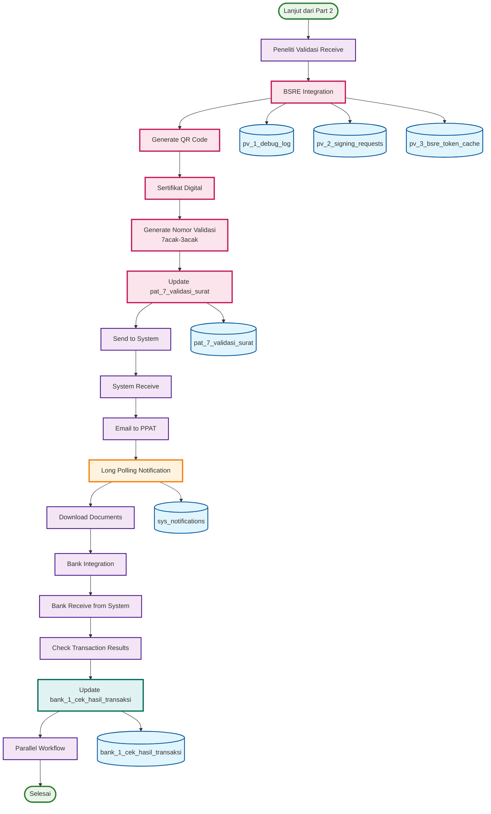

# ACTIVITY DIAGRAM - ITERASI 2 (PART 3)
## Peneliti Validasi → System → Bank Process dengan BSRE (Halaman 3)

## WORKFLOW PART 3 - PENELITI VALIDASI → SYSTEM → BANK (ITERASI 2):

### 🎯 **Peneliti Validasi Process (7 langkah):**
1. **Peneliti Validasi Receive** - Terima dari Clear to Paraf
2. **BSRE Integration** - **🆕 FITUR BARU** - Integrasi dengan BSRE
3. **Generate QR Code** - **🆕 FITUR BARU** - Generate QR code
4. **Sertifikat Digital** - **🆕 FITUR BARU** - Generate sertifikat digital
5. **Generate Nomor Validasi** - **🆕 FITUR BARU** - Generate nomor validasi (7acak-3acak)
6. **Update pat_7_validasi_surat** - **🆕 DATABASE BARU** - Update database validasi surat
7. **Send to System** - Kirim ke sistem

### 🎯 **System Process (5 langkah):**
1. **System Receive** - Terima dari peneliti validasi
2. **Email to PPAT** - **🆕 NOTIFIKASI** - Kirim email ke PPAT
3. **Long Polling Notification** - **🆕 NOTIFIKASI** - Notifikasi real-time
4. **Download Documents** - **🆕 FITUR BARU** - Download dokumen via email
5. **Bank Integration** - **🆕 INTEGRASI** - Integrasi dengan Bank

### 🎯 **Bank Process (4 langkah):**
1. **Bank Receive from System** - Terima dari sistem
2. **Check Transaction Results** - **🆕 FITUR BARU** - Cek hasil transaksi
3. **Update bank_1_cek_hasil_transaksi** - **🆕 DATABASE BARU** - Update database bank
4. **Parallel Workflow** - **🆕 WORKFLOW** - Workflow paralel

## PERUBAHAN UTAMA ITERASI 2 - PART 3:

### 🆕 **FITUR BARU:**
- **BSRE Integration** - Integrasi dengan BSRE
- **QR Code Generation** - Generate QR code
- **Sertifikat Digital** - Generate sertifikat digital
- **Nomor Validasi** - Generate nomor validasi (7acak-3acak)
- **Email Notification** - Email otomatis ke PPAT
- **Long Polling** - Notifikasi real-time
- **Download Documents** - Download dokumen via email
- **Bank Integration** - Integrasi dengan Bank
- **Parallel Workflow** - Workflow paralel

### 📊 **DATABASE TABLES - PART 3 (6 TABEL):**

#### **🆕 New Tables:**
1. **pv_1_debug_log** - **BARU** - Log debugging BSRE
2. **pv_2_signing_requests** - **BARU** - Request penandatanganan
3. **pv_3_bsre_token_cache** - **BARU** - Cache token BSRE
4. **pat_7_validasi_surat** - **BARU** - Validasi surat dengan nomor validasi
5. **sys_notifications** - **BARU** - Notifikasi sistem
6. **bank_1_cek_hasil_transaksi** - **BARU** - Cek hasil transaksi bank

## KEY FEATURES - PART 3:

### ✅ **BSRE Integration:**
- **Autentikasi Digital** - Sertifikat digital
- **QR Code Generation** - Generate QR code
- **Nomor Validasi** - 7acak-3acak untuk tracking
- **Debug Logging** - Log debugging BSRE

### ✅ **Notifikasi Real-time:**
- **Email Otomatis** - Email ke PPAT pembuat
- **Long Polling** - Notifikasi real-time untuk pegawai
- **Download Documents** - Download dokumen via email
- **System Integration** - Integrasi dengan sistem

### ✅ **Bank Integration:**
- **Workflow Paralel** - LTB + Bank parallel
- **Transaction Results** - Cek hasil transaksi
- **Database Integration** - bank_1_cek_hasil_transaksi

## WORKFLOW SUMMARY - PART 3:

### 📋 **Total Steps: 16 Langkah**
- **Peneliti Validasi Process**: 7 langkah
- **System Process**: 5 langkah
- **Bank Process**: 4 langkah
- **Database Updates**: 6 tables
- **New Features**: 8 fitur baru

### 📋 **Process Flow:**
- **Sequential**: Peneliti Validasi → System → Bank
- **BSRE Integration** - Integrasi BSRE di peneliti validasi
- **Parallel Workflow** - LTB + Bank parallel
- **Database**: 6 tables terintegrasi

### 📋 **Perubahan dari Iterasi 1:**
- **🆕 BSRE Integration** - Integrasi dengan BSRE
- **🆕 Notifikasi Real-time** - Email dan long polling
- **🆕 Bank Integration** - Integrasi dengan Bank
- **🆕 6 Database Tables** - Tabel baru untuk fitur baru
- **🆕 Parallel Workflow** - Workflow paralel

### 📋 **Efisiensi yang Dicapai:**
- **Digital Certificate** - Sertifikat digital
- **Real-time Notification** - Notifikasi real-time
- **Bank Integration** - Integrasi dengan Bank
- **Parallel Processing** - Proses paralel
- **Automated Workflow** - Workflow otomatis

## COMPLETE WORKFLOW SUMMARY - ITERASI 2:

### 📋 **Total Steps: 38 Langkah (3 Parts)**
- **Part 1**: 12 langkah (PPAT → LTB dengan otomasi)
- **Part 2**: 10 langkah (Peneliti → Clear to Paraf dengan otomasi)
- **Part 3**: 16 langkah (Peneliti Validasi → System → Bank dengan BSRE)

### 📋 **Database Tables: 11 Tables Total**
- **Part 1**: 3 tables (1 new + 2 existing)
- **Part 2**: 2 tables (2 updated)
- **Part 3**: 6 tables (6 new)

### 📋 **New Features: 11 Features Total**
- **Part 1**: 3 fitur baru
- **Part 2**: 1 fitur otomasi
- **Part 3**: 8 fitur baru

### 📋 **Automation Features: 2 Features Total**
- **Part 1**: Otomatis isi pat_6_sign
- **Part 2**: Otomatis tempel tanda tangan
