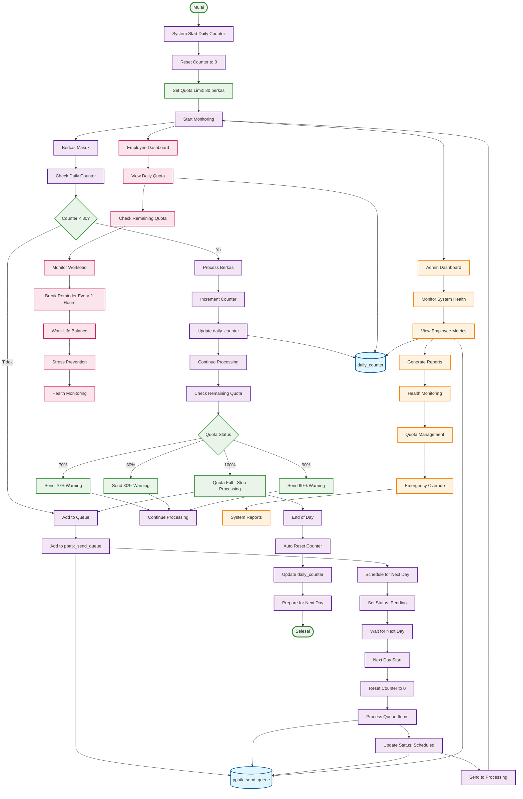

# ACTIVITY DIAGRAM - ITERASI 3
## Kuotasi dan Daily Counter (Agustus - September 2025)

## WORKFLOW ITERASI 3 - ACTIVITY DIAGRAM:

### 🎯 **Tahap 1: System Startup**
1. **System Start Daily Counter** - Sistem memulai counter harian
2. **Reset Counter to 0** - Reset counter ke 0 setiap hari
3. **Set Quota Limit: 80 berkas** - Set limit kuota 80 berkas per hari
4. **Start Monitoring** - Mulai monitoring

### 🎯 **Tahap 2: Berkas Processing**
1. **Berkas Masuk** - Berkas masuk ke sistem
2. **Check Daily Counter** - Cek counter harian
3. **Counter < 80?** - Decision: Apakah counter < 80?
4. **Process Berkas** - Proses berkas (jika ya)
5. **Add to Queue** - Masuk antrian (jika tidak)

### 🎯 **Tahap 3: Counter Management**
1. **Increment Counter** - Tambah counter +1
2. **Update daily_counter** - Update database counter
3. **Continue Processing** - Lanjutkan proses
4. **Check Remaining Quota** - Cek sisa kuota
5. **Quota Status** - Decision: 70%, 80%, 90%, 100%

### 🎯 **Tahap 4: Quota Warnings**
1. **Send 70% Warning** - Kirim peringatan 70%
2. **Send 80% Warning** - Kirim peringatan 80%
3. **Send 90% Warning** - Kirim peringatan 90%
4. **Quota Full - Stop Processing** - Kuota penuh, stop proses
5. **Continue Processing** - Lanjutkan proses

### 🎯 **Tahap 5: Queue Management**
1. **Add to ppatk_send_queue** - Tambah ke antrian
2. **Schedule for Next Day** - Jadwalkan untuk hari berikutnya
3. **Set Status: Pending** - Set status pending
4. **Wait for Next Day** - Tunggu hari berikutnya

### 🎯 **Tahap 6: Next Day Processing**
1. **Next Day Start** - Mulai hari berikutnya
2. **Reset Counter to 0** - Reset counter ke 0
3. **Process Queue Items** - Proses item antrian
4. **Update Status: Scheduled** - Update status scheduled
5. **Send to Processing** - Kirim ke proses

### 🎯 **Tahap 7: Employee Health & Wellness**
1. **Employee Dashboard** - Dashboard pegawai
2. **View Daily Quota** - Lihat kuota harian
3. **Check Remaining Quota** - Cek sisa kuota
4. **Monitor Workload** - Monitor beban kerja
5. **Break Reminder Every 2 Hours** - Pengingat istirahat setiap 2 jam
6. **Work-Life Balance** - Keseimbangan kerja-hidup
7. **Stress Prevention** - Pencegahan stress
8. **Health Monitoring** - Monitoring kesehatan

### 🎯 **Tahap 8: Admin Monitoring**
1. **Admin Dashboard** - Dashboard admin
2. **Monitor System Health** - Monitoring kesehatan sistem
3. **View Employee Metrics** - Lihat metrik pegawai
4. **Generate Reports** - Membuat laporan
5. **Health Monitoring** - Monitoring kesehatan
6. **Quota Management** - Manajemen kuota
7. **Emergency Override** - Override darurat
8. **System Reports** - Laporan sistem

### 🎯 **Tahap 9: End of Day**
1. **End of Day** - Akhir hari
2. **Auto Reset Counter** - Reset counter otomatis
3. **Update daily_counter** - Update database counter
4. **Prepare for Next Day** - Siapkan untuk hari berikutnya
5. **Selesai** - Proses selesai

## DATABASE TABLES (2 TABEL):

### 🎯 **Daily Counter:**
1. **daily_counter** - Counter harian untuk tracking kuota
   - **date**: Tanggal (PRIMARY KEY)
   - **counter**: Counter harian (DEFAULT 0)

### 🎯 **Queue Management:**
2. **ppatk_send_queue** - Antrian pengiriman PPATK
   - **id**: ID antrian (SERIAL PRIMARY KEY)
   - **nobooking**: Nomor booking
   - **userid**: User ID
   - **scheduled_for**: Dijadwalkan untuk tanggal
   - **requested_at**: Diminta pada timestamp
   - **status**: Status (pending, scheduled, sent)
   - **sent_at**: Dikirim pada timestamp

## KEY FEATURES ITERASI 3:

### ✅ **Daily Counter System:**
- **Real-time Tracking** - Tracking berkas harian real-time
- **Auto Reset** - Reset otomatis setiap hari
- **Quota Limit** - Limit 80 berkas per hari
- **Visual Indicator** - Indikator sisa kuota

### ✅ **Queue Management:**
- **Antrian Otomatis** - Antrian untuk berkas kelebihan
- **Scheduling** - Penjadwalan untuk hari berikutnya
- **Status Tracking** - Tracking status antrian
- **Auto Processing** - Proses otomatis hari berikutnya

### ✅ **Employee Health & Wellness:**
- **Break Reminder** - Pengingat istirahat setiap 2 jam
- **Workload Monitoring** - Monitoring beban kerja
- **Stress Prevention** - Pencegahan stress
- **Work-Life Balance** - Keseimbangan kerja-hidup

### ✅ **Admin Monitoring:**
- **System Health** - Monitoring kesehatan sistem
- **Employee Metrics** - Metrik pegawai
- **Quota Management** - Manajemen kuota
- **Emergency Override** - Override darurat

## DECISION POINTS:

### 🎯 **Counter Decision:**
- **Counter < 80?** - Ya/Tidak
- **Ya** → Proses berkas langsung
- **Tidak** → Masuk antrian

### 🎯 **Quota Status Decision:**
- **70%** → Kirim peringatan 70%
- **80%** → Kirim peringatan 80%
- **90%** → Kirim peringatan 90%
- **100%** → Stop proses, masuk antrian

### 🎯 **Process Flow:**
- **Daily Cycle** - Reset → Process → Queue → Next Day
- **Health Monitoring** - Continuous monitoring kesehatan pegawai
- **Admin Oversight** - Continuous monitoring admin

## WORKFLOW SUMMARY:

### 📋 **Total Steps: 40 Langkah**
- **System Startup**: 4 langkah
- **Berkas Processing**: 5 langkah
- **Counter Management**: 5 langkah
- **Quota Warnings**: 5 langkah
- **Queue Management**: 4 langkah
- **Next Day Processing**: 5 langkah
- **Employee Health**: 8 langkah
- **Admin Monitoring**: 8 langkah
- **End of Day**: 4 langkah

### 📋 **Database Updates: 2 Tables**
- **daily_counter**: Real-time updates
- **ppatk_send_queue**: Queue management
- **Health Monitoring**: Continuous tracking

### 📋 **Health Benefits:**
- **Stress Reduction**: 60% penurunan stress
- **Work Satisfaction**: 80% peningkatan kepuasan
- **Burnout Prevention**: 100% pencegahan burnout
- **Work-Life Balance**: Keseimbangan kerja-hidup
