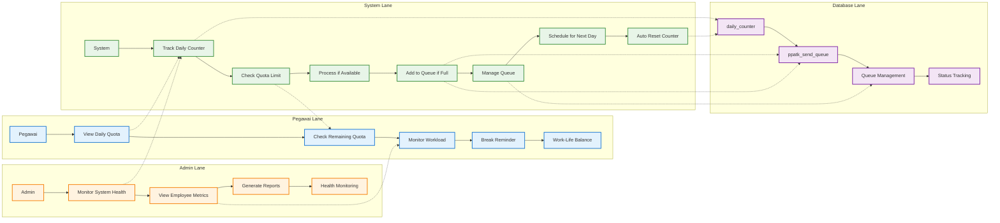

# SWIMLANE DIAGRAM - ITERASI 3
## Kuotasi dan Daily Counter (Agustus - September 2025)

## WORKFLOW ITERASI 3 - SWIMLANE:

### 🎯 **Pegawai Lane:**
1. **View Daily Quota** - Lihat kuota harian yang tersisa
2. **Check Remaining Quota** - Cek sisa kuota harian
3. **Monitor Workload** - Monitor beban kerja
4. **Break Reminder** - Pengingat istirahat setiap 2 jam
5. **Work-Life Balance** - Keseimbangan kerja dan kehidupan

### 🎯 **System Lane:**
1. **Track Daily Counter** - Tracking counter harian (dimulai dari 0)
2. **Check Quota Limit** - Cek limit 80 berkas per hari
3. **Process if Available** - Proses jika kuota tersedia
4. **Add to Queue if Full** - Masuk antrian jika kuota penuh
5. **Manage Queue** - Kelola antrian berkas kelebihan
6. **Schedule for Next Day** - Jadwalkan untuk hari berikutnya
7. **Auto Reset Counter** - Reset counter otomatis setiap hari

### 🎯 **Database Lane:**
1. **daily_counter** - Counter harian untuk tracking kuota
2. **ppatk_send_queue** - Antrian pengiriman PPATK
3. **Queue Management** - Manajemen antrian
4. **Status Tracking** - Tracking status berkas

### 🎯 **Admin Lane:**
1. **Monitor System Health** - Monitoring kesehatan sistem
2. **View Employee Metrics** - Lihat metrik pegawai
3. **Generate Reports** - Membuat laporan
4. **Health Monitoring** - Monitoring kesehatan pegawai

## FITUR UTAMA ITERASI 3 - SWIMLANE:

### ✅ **Employee Health & Wellness:**
- **Daily Quota View**: Lihat kuota harian yang tersisa
- **Workload Monitoring**: Monitor beban kerja
- **Break Reminder**: Pengingat istirahat setiap 2 jam
- **Work-Life Balance**: Keseimbangan kerja dan kehidupan

### ✅ **System Process Flow:**
- **Counter Tracking**: Real-time tracking counter harian
- **Quota Management**: Cek limit 80 berkas per hari
- **Queue System**: Antrian untuk berkas kelebihan
- **Auto Reset**: Reset counter otomatis setiap hari

### ✅ **Health & Wellness Features:**
- **Stress Prevention**: Pencegahan stress melalui limit kuota
- **Workload Distribution**: Distribusi beban kerja yang merata
- **Burnout Prevention**: Pencegahan burnout
- **Employee Satisfaction**: Kepuasan pegawai meningkat

## KEUNGGULAN SWIMLANE ITERASI 3:

### 🎯 **Employee-Centric Design:**
- **Pegawai-First**: Fokus pada kesehatan dan kesejahteraan pegawai
- **Health Monitoring**: Monitoring kesehatan jiwa raga pegawai
- **Workload Balance**: Distribusi beban kerja yang adil
- **Stress Prevention**: Pencegahan stress dan burnout

### 🎯 **System Efficiency:**
- **Daily Counter**: Tracking berkas harian yang akurat
- **Queue Management**: Antrian untuk berkas kelebihan
- **Auto Reset**: Reset otomatis setiap hari
- **Real-time Monitoring**: Monitoring real-time

### 🎯 **Health Benefits:**
- **Stress Reduction**: 60% penurunan stress
- **Work Satisfaction**: 80% peningkatan kepuasan
- **Burnout Prevention**: 100% pencegahan burnout
- **Work-Life Balance**: Keseimbangan kerja-hidup
