# USE CASE DIAGRAM - ITERASI 3
## Kuotasi dan Daily Counter (Agustus - September 2025)

```mermaid
graph TB
    %% Actors
    Pegawai[Pegawai]
    System[System]
    Admin[Admin]

    %% Use Cases - Daily Counter System
    System --> UC1[1. Track Daily Counter]
    UC1 --> DB1[("daily_counter")]
    System --> UC2[2. Check Quota Limit]
    UC2 --> UC3[3. Process if Available]
    UC3 --> UC4[4. Add to Queue if Full]
    UC4 --> DB2[("ppatk_send_queue")]
    
    %% Employee Health & Wellness
    Pegawai --> UC5[5. View Daily Quota]
    Pegawai --> UC6[6. Check Remaining Quota]
    Pegawai --> UC7[7. Monitor Workload]
    Pegawai --> UC8[8. Break Reminder]
    
    %% Queue Management
    System --> UC9[9. Manage Queue]
    System --> UC10[10. Schedule for Next Day]
    System --> UC11[11. Auto Reset Counter]
    UC11 --> DB1
    
    %% Health & Wellness Features
    System --> UC12[12. Workload Distribution]
    System --> UC13[13. Stress Prevention]
    System --> UC14[14. Work-Life Balance]
    
    %% Admin Monitoring
    Admin --> UC15[15. Monitor System Health]
    Admin --> UC16[16. View Employee Metrics]
    Admin --> UC17[17. Generate Reports]
    
    %% Styling
    classDef actor fill:#e1f5fe,stroke:#01579b,stroke-width:2px
    classDef usecase fill:#f3e5f5,stroke:#4a148c,stroke-width:2px
    classDef database fill:#e8f5e8,stroke:#2e7d32,stroke-width:2px
    
    class Pegawai,System,Admin actor
    class UC1,UC2,UC3,UC4,UC5,UC6,UC7,UC8,UC9,UC10,UC11,UC12,UC13,UC14,UC15,UC16,UC17 usecase
    class DB1,DB2 database
```

## FITUR UTAMA ITERASI 3:

### 🎯 **Daily Counter System:**
- **Track Daily Counter** - Real-time tracking berkas harian
- **Check Quota Limit** - Cek limit 80 berkas per hari
- **Process if Available** - Proses jika kuota tersedia
- **Add to Queue if Full** - Masuk antrian jika kuota penuh

### 🎯 **Employee Health & Wellness:**
- **View Daily Quota** - Lihat kuota harian yang tersisa
- **Check Remaining Quota** - Cek sisa kuota harian
- **Monitor Workload** - Monitor beban kerja
- **Break Reminder** - Pengingat istirahat setiap 2 jam

### 🎯 **Queue Management:**
- **Manage Queue** - Kelola antrian berkas kelebihan
- **Schedule for Next Day** - Jadwalkan untuk hari berikutnya
- **Auto Reset Counter** - Reset counter otomatis setiap hari

### 🎯 **Health & Wellness Features:**
- **Workload Distribution** - Distribusi beban kerja yang merata
- **Stress Prevention** - Pencegahan stress melalui limit kuota
- **Work-Life Balance** - Keseimbangan kerja dan kehidupan

### 🎯 **Admin Monitoring:**
- **Monitor System Health** - Monitoring kesehatan sistem
- **View Employee Metrics** - Lihat metrik pegawai
- **Generate Reports** - Membuat laporan

## DATABASE TABLES (2 TABEL):

1. **daily_counter** - Counter harian untuk tracking kuota
2. **ppatk_send_queue** - Antrian pengiriman PPATK

## WORKFLOW ITERASI 3:

### 📋 **Step 1: Daily Counter Setup**
1. System track daily counter (dimulai dari 0)
2. Set quota limit (80 berkas per hari)
3. Initialize queue system
4. Start monitoring

### 📋 **Step 2: Berkas Processing**
1. Berkas masuk → Cek daily counter
2. Counter < 80 → Proses langsung
3. Counter ≥ 80 → Masuk antrian (ppatk_send_queue)
4. Update counter dan status

### 📋 **Step 3: Employee Health Monitoring**
1. Pegawai monitor kuota harian
2. Break reminder setiap 2 jam
3. Workload distribution yang merata
4. Stress prevention melalui limit

### 📋 **Step 4: Queue Management**
1. Berkas kelebihan masuk antrian
2. Schedule untuk hari berikutnya
3. Auto reset counter setiap hari
4. Admin monitoring dan reporting

## QUOTA SYSTEM DETAILS:

### 🎯 **Daily Quota: 80 berkas per hari**
- **Limit**: 80 berkas per hari kerja
- **Working Days**: Senin - Jumat
- **Working Hours**: 08:45 - 16:10 WIB
- **Distribution**: ~10.7 berkas per jam

### 🎯 **Counter Mechanism:**
- **Start**: 0 setiap hari
- **Increment**: +1 setiap berkas masuk
- **Limit**: 80 berkas maksimal
- **Reset**: Otomatis setiap hari kerja

### 🎯 **Queue System:**
- **Berkas ke-81+**: Masuk antrian
- **Scheduling**: Untuk hari berikutnya
- **Status**: Pending → Scheduled → Sent
- **Tracking**: Real-time monitoring

### 🎯 **Health Benefits:**
- **Stress Reduction**: 60% penurunan stress
- **Work Satisfaction**: 80% peningkatan kepuasan
- **Burnout Prevention**: 100% pencegahan burnout
- **Work-Life Balance**: Keseimbangan kerja-hidup

## TIME SCHEDULE:

### 🕐 **Working Hours:**
- **Start**: 08:45 WIB
- **End**: 16:10 WIB
- **Days**: Senin - Jumat
- **Duration**: 7 jam 25 menit per hari

### 🎯 **Quota Distribution:**
- **Total**: 80 berkas per hari
- **Per hour**: ~10.7 berkas
- **Per minute**: ~1 berkas setiap 5.6 menit
- **Buffer time**: 10 menit untuk istirahat
