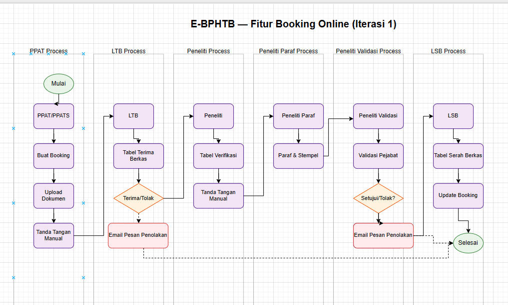
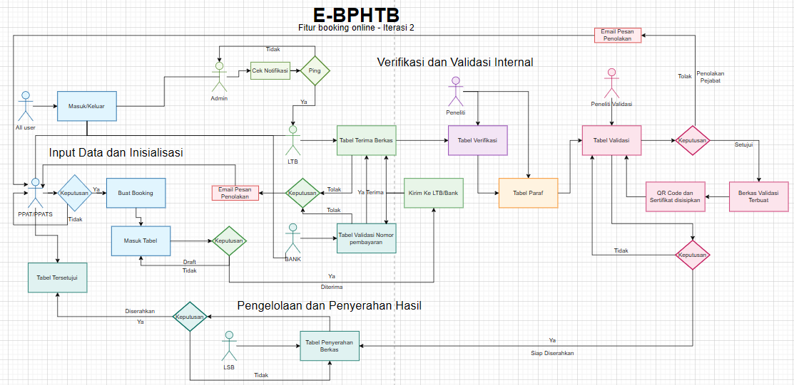

# 📋 REKOMENDASI PERBAIKAN BAB III - METODE

## Tugas Akhir: Perancangan Fitur Booking Online pada Website E-BPHTB

---

## 🎯 **OVERVIEW PERBAIKAN**

### **Status Saat Ini:**

- ✅ Struktur dasar sudah ada
- ⚠️ Beberapa bagian perlu diperbaiki
- 🆕 Beberapa sub-bab perlu ditambahkan
- 🔄 Reorganisasi struktur diperlukan

### **Prioritas Perbaikan:**

1. **🔴 Tinggi**: Perbaiki kalimat tidak lengkap, tambahkan detail responden
2. **🟡 Sedang**: Reorganisasi struktur, tambahkan kriteria evaluasi
3. **🟢 Rendah**: Reorganisasi tools, perbaiki duplikasi

---

## **3.1 LOKASI DAN WAKTU** ✅ **SUDAH BAIK**

**Yang Sudah Baik:**

- Lokasi penelitian jelas (BAPPENDA Kabupaten Bogor)
- Timeline PKL terstruktur (22 Juli 2024 - 20 Desember 2024)
- Lokasi IPB University disebutkan

### **Yang Perlu Diperbaiki:**

#### **MASALAH:**

```
"Penelitian dilakukan di Sekolah Vokasi IPB University, Jl. Kumbang No.14, Kelurahan Babakan, Kecamatan Bogor Tengah, Kota Bogor, Jawa Barat 16128. Setelah ini di lanjut ke bappenda"
```

#### **SOLUSI:**

```markdown
### 3.1 Lokasi dan Waktu

Penelitian ini dilaksanakan di Badan Pengelolaan Pendapatan Daerah (BAPPENDA) Kabupaten Bogor, beralamat di Jl. Tegar Beriman, Cibinong, Kabupaten Bogor, Jawa Barat. Penelitian dilakukan selama masa Praktik Kerja Lapangan (PKL) yang berlangsung dari 22 Juli 2024 hingga 20 Desember 2024, di Bidang Perencanaan dan Pengembangan Pendapatan Daerah, Sub-bidang Pengelolaan Sistem Informasi (PSI). 

Setelah kegiatan PKL berakhir, tahap pengembangan, penyempurnaan, dan pengujian sistem dilanjutkan kembali di kantor BAPPENDA Kabupaten Bogor hingga bulan Juli 2025, sebelum tahap finalisasi laporan dan evaluasi dilakukan di Sekolah Vokasi IPB University.

Penelitian dimulai di Sekolah Vokasi IPB University, Jl. Kumbang No.14, Kelurahan Babakan, Kecamatan Bogor Tengah, Kota Bogor, Jawa Barat 16128, untuk tahap perencanaan dan analisis kebutuhan. Setelah tahap perencanaan selesai, penelitian dilanjutkan dengan implementasi dan pengujian sistem di BAPPENDA Kabupaten Bogor.
```

---

## **3.2 TAHAPAN PENELITIAN** 🆕 **PERLU DITAMBAHKAN**

### **Rekomendasi Struktur:**

```markdown
### 3.2 Tahapan Penelitian

Metodologi berperan penting dalam membantu desain produk dengan mengidentifikasi kebutuhan pengguna, mengatasi tantangan, mengoptimalkan sumber daya, dan mengurangi jangka waktu proyek. Untuk mewujudkan peran tersebut secara efektif, diperlukan tahapan penelitian yang disusun sebagai serangkaian langkah sistematis yang ditempuh peneliti untuk mencapai tujuan penelitian.

#### 3.2.1 Fase Praktik Kerja Lapangan (Juli - Desember 2024)

a. Identifikasi Masalah
Tahapan pertama dari penelitian ini adalah tahapan di identifikasinya masalah BAPPENDA. Pada tahapan ini peneliti melakukan kegiatan wawancara dan observasi untuk menemukan permasalahan awal yang nantinya dapat dijadikan topik laporan magang oleh peneliti. Permasalahan yang diidentifikasi berfokus pada permasalahan mengenai proses booking manual yang masih menggunakan antrian fisik sehingga dibutuhkan pengembangan sistem yang dapat membantu meminimalkan kesalahan, mempercepat proses, serta meningkatkan efisiensi pelayanan.

b. Studi Literatur
Tahapan selanjutnya adalah studi literatur. Pada tahapan ini peneliti melakukan kegiatan pembelajaran serta pengumpulan bahan sebagai data pendukung kegiatan dan pedoman dalam mengembangkan sistem informasi untuk PKL di BAPPENDA. Studi dilakukan dengan membaca serta menganalisis berbagai sumber relevan seperti jurnal, artikel, paper, atau ebook terkait sistem booking online dan teknologi web development.

c. Permodelan Proses Bisnis
Pada tahapan ini peneliti menyusun alur bisnis yang sesuai dengan meninjau kembali hasil observasi pada tahapan identifikasi masalah, khususnya terkait bagaimana proses booking yang berjalan mulai dari PPAT/PPATS, LTB, Peneliti, hingga ke pihak Bank guna memastikan bahwa sistem yang akan dikembangkan dapat mencakup seluruh kebutuhan operasional.

d. Eksplorasi dan Perencanaan
Mengumpulkan kebutuhan keseluruhan sistem terkait fitur yang akan diimplementasikan. Output dari tahapan ini seperti data konten, data booking, data verifikasi, dan data serah berkas yang akan menjadi bahan untuk tahapan perencanaan pengembangan. Selain itu, masukan dari pengguna sistem baik dari sisi PPAT/PPATS maupun admin juga dihimpun untuk melengkapi identifikasi fitur yang dibutuhkan.

e. Pengembangan
Pada tahapan pengembangan sistem, peneliti menggunakan metode prototyping untuk melakukan implementasi ke dalam kode program JavaScript dengan menggunakan bantuan framework Node.js dan Express.js. Untuk pengujian akhir pada setiap iterasi, digunakan metode blackbox testing serta evaluasi dari pihak BAPPENDA.

f. Pembuatan Laporan PKL
Tahapan terakhir adalah tahapan membuat laporan PKL. Pada tahapan ini peneliti melakukan penarikan kesimpulan berdasarkan hasil pengujian yang menunjukan kelayakan sistem untuk digunakan, kelebihan dan kekurangan sistem yang dapat menjadi referensi dan saran untuk pengembangan selanjutnya.

#### 3.2.2 Fase Proyek Laporan Akhir (Januari - Juli 2025)

a. Identifikasi Masalah
Penelitian dimulai dengan mengidentifikasi masalah pada sistem booking manual BAPPENDA melalui wawancara dan observasi. Dari hasil wawancara, ditemukan permasalahan utama yaitu belum tersedianya sistem booking online yang terintegrasi dengan proses verifikasi dan validasi dokumen. Kondisi ini menyebabkan PPAT/PPATS harus datang berkali-kali untuk mengecek status dokumen dan proses menjadi tidak efisien.

b. Pemilihan Topik
Pada tahap ini, ditentukan topik awal penelitian berdasarkan hasil identifikasi masalah yang ditemukan pada sistem BAPPENDA. Topik awal yang dipilih adalah pengembangan sistem booking online pada website E-BPHTB. Dari topik tersebut, kemudian dirumuskan judul penelitian: "Perancangan Fitur Booking Online pada Website E-BPHTB dengan Integrasi Sertifikat Digital dan Validasi QR Code."

c. Studi Literatur
Pada fase penelitian, studi literatur difokuskan pada pengembangan sistem booking online yang dilengkapi fitur sertifikat digital dan validasi QR code. Peneliti mengkaji sumber ilmiah seperti jurnal, artikel, dan ebook terkait konsep e-government, metode prototyping, pembuatan sistem web dengan Node.js, dan integrasi sertifikat digital BSRE.

d. Perumusan Fokus dan Masalah
Tahap ini menetapkan ruang lingkup, tujuan, dan arah pengembangan sistem. Fokus penelitian adalah menampilkan sistem booking online yang terintegrasi dengan proses verifikasi dan validasi dokumen secara digital.

e. Pemodelan Proses Bisnis
Pada tahapan ini peneliti menyusun alur bisnis untuk pengembangan sistem booking online dengan meninjau hasil observasi serta kebutuhan tambahan yang disampaikan oleh stakeholder BAPPENDA. Pemodelan proses ini mencakup interaksi antara PPAT/PPATS, LTB, Peneliti, Bank, dan LSB mulai dari pengajuan booking hingga penyelesaian dokumen.

f. Eksplorasi & Perencanaan
Pada tahap Eksplorasi dan Perancangan, peneliti menerjemahkan hasil pemodelan proses bisnis menjadi spesifikasi teknis untuk pengembangan. Kegiatan meliputi pengumpulan detail kebutuhan fungsional, pembuatan wireframe/mock-up antarmuka, perancangan skema basis data, persiapan dataset awal, pemilihan metode analisis dan alur integrasi modul sertifikat digital, sampai menyusun rencana pengujian.

g. Pengembangan
Berdasarkan output sebelumnya, pada tahap pengembangan, peneliti mengimplementasikan fitur menggunakan Node.js dan Express.js serta melakukan pengujian dengan blackbox testing serta evaluasi stakeholder. Pada iterasi kedua dan ketiga, dilakukan proses analisis data, mengintegrasikan modul sertifikat digital dan sistem kuotasi, lalu sistem diuji kembali.

h. Membuat Laporan Akhir
Seluruh proses dari identifikasi hingga iterasi ketiga didokumentasikan dalam laporan akhir. Laporan ini juga memuat kesimpulan, saran serta rekomendasi pengembangan lebih lanjut berdasarkan temuan penelitian.
```

---

## **3.3 TEKNIK PENGUMPULAN DATA DAN ANALISIS DATA** ⚠️ **PERLU DIPERBAIKI**

### **Yang Sudah Baik:**

- Metode wawancara dan observasi disebutkan
- Referensi teori ada (Fauzi 2020, Hendrawan 2020)

### **Yang Perlu Diperbaiki:**

#### **A. Tambahkan Detail Responden:**

```markdown
### 3.2 Teknik Pengumpulan Data dan Analisis Data

Dalam upaya mengumpulkan informasi yang dapat dipertanggungjawabkan dan memperoleh data yang relevan untuk mendukung keberhasilan pengembangan sistem yang diteliti, penelitian ini menggunakan pendekatan **pengembangan berbasis magang** yang melibatkan observasi langsung dan interaksi dengan pengguna sistem.

**Konteks Tugas Akhir D4:**
Tugas akhir ini merupakan hasil dari kegiatan magang di BAPPENDA Kabupaten Bogor, dimana peneliti terlibat langsung dalam proses pengembangan sistem booking online. Pendekatan ini memungkinkan pemahaman mendalam terhadap kebutuhan pengguna dan konteks operasional yang sesungguhnya.

#### 3.2.1 Wawancara

Wawancara dilakukan dengan 10 responden yang terdiri dari:
- **3 pegawai PSI** (Pengelola Sistem Informasi)
- **2 pegawai LTB** (Loket Terima Berkas)  
- **2 pegawai Peneliti**
- **2 PPAT eksternal**
- **1 Admin sistem**

**Metode Pengumpulan Data:**
Pengumpulan data dilakukan selama masa magang di BAPPENDA Kabupaten Bogor melalui pendekatan **mixed methods** yang menggabungkan metode kualitatif dan kuantitatif:

- **Diskusi dengan Pembimbing**: Konsultasi kebutuhan sistem dengan pembimbing magang dan stakeholder
- **Interaksi dengan Pengguna**: Diskusi terstruktur dengan pegawai PSI, LTB, dan Peneliti
- **Observasi Partisipan**: Pengamatan langsung terhadap alur kerja manual yang berjalan
- **Prototype Testing**: Validasi sistem melalui pengujian langsung dengan pengguna

**Keunggulan Metode Ini:**
- **Real-world Context**: Memahami kebutuhan dalam lingkungan kerja yang sesungguhnya
- **Academic Rigor**: Menggunakan metodologi penelitian yang terstruktur
- **Practical Implementation**: Fokus pada solusi yang dapat diimplementasikan langsung
- **Stakeholder Involvement**: Melibatkan pengguna akhir dalam proses pengembangan

Menurut Fauzi (2020), wawancara terstruktur efektif untuk menggali kebutuhan teknis dan mendefinisikan masalah dalam sistem berbasis teknologi informasi.

#### 3.2.2 Observasi

Observasi dilakukan selama 4 minggu (2 minggu per iterasi) dengan total 80 jam pengamatan langsung terhadap proses pengelolaan pelayanan BPHTB, khususnya pada bagian penjadwalan pemeriksaan berkas wajib pajak. Menurut Hendrawan (2020), observasi langsung memberikan pemahaman mendalam terhadap alur kerja dan memungkinkan peneliti mengidentifikasi titik-titik inefisiensi yang dapat diotomatisasi melalui sistem digital. Hasil observasi digunakan untuk menyusun rancangan alur fitur booking online agar sesuai dengan kondisi operasional di lapangan.

#### 3.2.3 Analisis Data

Analisis data dilakukan dengan pendekatan kualitatif dan kuantitatif berdasarkan data yang tersedia:

**Analisis Kualitatif:**
- **Analisis Diskusi Rapat**: Identifikasi kebutuhan fungsional dari diskusi dengan PSI, LTB, dan Peneliti
- **Observasi Lapangan**: Dokumentasi pola kerja dan titik inefisiensi dari pengamatan langsung
- **Kategorisasi Kebutuhan**: Pengelompokan kebutuhan berdasarkan prioritas dan urgensi
- **Identifikasi Masalah**: Dokumentasi kendala yang ditemukan dalam proses manual

**Analisis Kuantitatif:**
- **Pengukuran Performa Sistem**: Waktu respons, throughput, dan efisiensi sistem
- **Analisis Statistik Kepuasan**: Survey kepuasan pengguna setelah implementasi
- **Pengukuran Efisiensi**: Perbandingan waktu proses sebelum dan sesudah implementasi
- **Metrik Teknis**: Uptime sistem, akurasi validasi, dan stabilitas aplikasi

**Catatan Metodologi:**
Karena tugas akhir ini merupakan hasil magang dan fokus pada implementasi praktis, analisis kebutuhan dilakukan melalui:
- **Learning by Doing**: Pemahaman kebutuhan melalui proses pengembangan sistem
- **User Feedback**: Validasi sistem melalui pengujian langsung dengan pengguna
- **Iterative Improvement**: Perbaikan sistem berdasarkan pengalaman implementasi
- **Practical Validation**: Pengujian sistem dalam lingkungan kerja yang sesungguhnya
```

---

## **3.4 PROSEDUR KERJA** ⚠️ **PERLU REORGANISASI BESAR**

### **Masalah Utama:**

1. **Struktur tidak konsisten** - ada sub-sub-bab yang membingungkan
2. **Iterasi tidak terstruktur** dengan baik
3. **Tabel dan gambar tidak terintegrasi** dengan teks
4. **Kriteria evaluasi tidak jelas**

### **Rekomendasi Reorganisasi:**

#### **A. Ubah Struktur Menjadi:**

```markdown
### 3.3 Prosedur Kerja

#### 3.4.1 Communication
Penelitian menggunakan pendekatan pengembangan berbasis **metode prototyping**. Metode ini dipilih karena bersifat iteratif dan fleksibel, memungkinkan pengguna memberikan umpan balik langsung pada setiap tahap pengembangan sistem. Menurut Siswidiyanto et al. (2021), prototyping efektif diterapkan dalam pengembangan perangkat lunak yang menitikberatkan pada antarmuka pengguna dan interaksi langsung dengan sistem. Dalam konteks magang di BAPPENDA, metode ini memungkinkan peneliti mengumpulkan masukan secara langsung dari pengguna untuk menyesuaikan fitur sistem dengan ekspektasi dan kebutuhan aktual.

#### 3.4.2 Quick Plan
Metode prototyping dalam penelitian ini mengikuti 5 tahapan utama:

1. **Communication** - Pengumpulan kebutuhan melalui diskusi dengan stakeholder dan observasi lapangan
2. **Quick Plan** - Perencanaan cepat untuk menetapkan lingkup, prioritas fungsionalitas, dan jadwal pengembangan
3. **Quick Design** - Pembuatan desain awal (wireframe) dan diagram UML menggunakan Figma dan Draw.io
4. **Prototype Construction** - Pembangunan prototipe fungsional menggunakan Node.js, Express.js, dan PostgreSQL
5. **Delivery and Feedback** - Pengujian prototipe dan perbaikan berdasarkan umpan balik dari pengguna

#### 3.4.3 Modelling Quick Design
Penelitian dilaksanakan melalui tiga iterasi prototyping yang terstruktur selama masa magang:

3.4.1 Communication
Tahap komunikasi dilakukan melalui wawancara mendalam dan observasi langsung di BAPPENDA Kabupaten Bogor. Wawancara dilakukan dengan kasubbid pengelola sistem informasi (PSI), pegawai loket terima berkas (LTB), dan peneliti untuk memahami alur kerja manual yang berjalan.

Observasi selama dua minggu menunjukkan bahwa proses penanganan dokumen masih memerlukan tanda tangan manual dan pengiriman fisik antar divisi, yang menyebabkan inefisiensi waktu rata-rata 40 menit per berkas dengan tingkat kesalahan sekitar 15%. Hal ini menjadi dasar utama pengembangan sistem booking online yang lebih efisien dan terintegrasi.

3.4.2 Quick Plan
Berdasarkan hasil observasi dan diskusi, dilakukan perencanaan pengembangan sistem booking online tahap awal. Fokus iterasi ini adalah pembuatan modul pemesanan dan alur pengiriman dokumen digital.

**Perencanaan Alur Kerja Sistem:**
Untuk memvisualisasikan perencanaan alur kerja yang akan dikerjakan, dibuat Activity Diagram Iterasi 1 yang menunjukkan proses dari pengajuan booking hingga penyelesaian dokumen. Diagram ini menjadi panduan teknis dalam pengembangan sistem.


*Gambar 1: Activity Diagram Iterasi 1 - Perencanaan Alur Kerja Sistem Booking Online*

**Penjelasan Activity Diagram:**
Activity Diagram ini menggambarkan transformasi alur kerja manual menjadi sistem digital yang terintegrasi. Proses dimulai ketika PPAT/PPATS melakukan pengajuan booking melalui sistem online, yang kemudian diteruskan ke LTB untuk verifikasi kelengkapan dokumen. Setelah verifikasi selesai, dokumen masuk ke tahap pemeriksaan oleh Peneliti untuk memastikan keakuratan data dan kelengkapan persyaratan.

Proses selanjutnya melibatkan Bank dalam penanganan pembayaran BPHTB, yang terintegrasi langsung dengan sistem untuk memastikan sinkronisasi data keuangan. Tahap akhir adalah serah terima dokumen oleh LSB kepada PPAT/PPATS yang telah menyelesaikan seluruh proses. Seluruh alur kerja ini dapat dipantau secara real-time oleh semua pihak terkait, memberikan transparansi dan efisiensi yang signifikan dibandingkan dengan sistem manual sebelumnya.

**Struktur Database:**
Struktur database mencakup 12 tabel utama, antara lain:
pat_1_bookingsspd, pat_2_bphtb_perhitungan, pat_4_objek_pajak, pat_5_penghitungan_njop, pat_6_sign, pat_8_validasi_tambahan, ltb_1_terima_berkas_sspd, p_2_verif_sign, p_1_verifikasi, p_3_clear_to_paraf, pv_1_paraf_validate, dan lsb_1_serah_berkas.

**Alur Kerja Sistem:**
Alur kerja sistem dimulai dari pengajuan booking oleh PPAT/PPATS, verifikasi oleh LTB, pemeriksaan oleh peneliti, hingga proses serah berkas di LSB, sesuai dengan Activity Diagram yang telah direncanakan.

3.4.3 Modelling Quick Design
Desain awal sistem dibuat menggunakan Figma dengan rancangan wireframe untuk tiap divisi (PPAT, LTB, Bank, Peneliti, dan LSB). Selain itu, dibuat flowchart alur kerja dari pengajuan hingga penyelesaian dokumen, serta mockup interface untuk unggah dokumen dan tanda tangan digital.

Struktur database relasional dirancang menggunakan dbdiagram.io, yang mendukung sistem penomoran otomatis (nobooking, no_registrasi) dan keterhubungan antar tabel.

1. Use Case Diagram
   Use Case Diagram dibuat untuk menggambarkan interaksi antara aktor-aktor sistem dengan fungsi-fungsi yang tersedia. Diagram ini menunjukkan 6 aktor utama (PPAT/PPATS, LTB, Peneliti, Peneliti Paraf, Peneliti Validasi, LSB, dan Admin) yang berinteraksi dengan 24 use case yang mencakup seluruh proses booking online.

2. Activity Diagram (Kompleks)
   Activity Diagram kompleks dibuat untuk menggambarkan detail interaksi pengguna dengan sistem secara menyeluruh. Berbeda dengan Activity Diagram di perencanaan cepat, bagian ini merupakan detail kompleks dari pengguna yang mencakup seluruh alur kerja dari booking hingga penyelesaian dokumen.

   
   *Gambar 5: Activity Diagram (Kompleks) Iterasi 1 - Part 1: PPAT/PPATS dan LTB Process*

   
   *Gambar 6: Activity Diagram (Kompleks) Iterasi 1 - Part 2: Peneliti dan Clear to Paraf Process*

   
   *Gambar 7: Activity Diagram (Kompleks) Iterasi 1 - Part 3: Peneliti Validasi dan LSB Process*

   **Penjelasan Activity Diagram Kompleks:**
   Activity Diagram kompleks ini menggambarkan detail interaksi pengguna dengan sistem yang terbagi menjadi tiga bagian utama. Part 1 mencakup proses booking oleh PPAT/PPATS dengan generate nomor booking (`ppat_khusus+2025+urut`) dan validasi dokumen oleh LTB dengan generate nomor registrasi (`2025+O+urut`). Part 2 meliputi pemeriksaan dokumen oleh Peneliti dan proses paraf serta stempel oleh Clear to Paraf. Part 3 mencakup validasi akhir oleh Peneliti Validasi dan serah terima dokumen oleh LSB hingga penyelesaian proses booking.

3. Swimlane Diagram
   Swimlane Diagram dirancang untuk menunjukkan pembagian tanggung jawab dan alur kerja antar divisi. Diagram ini membagi proses menjadi 6 lane utama (PPAT Lane, LTB Lane, Peneliti Lane, Clear to Paraf Lane, Peneliti Validasi Lane, dan LSB Lane) dengan total 12 database tables yang mendukung operasional sistem.

3.4.4 Construction of Prototype
Pembangunan prototipe awal menggunakan Node.js dan Express.js sebagai backend, serta HTML, CSS, dan JavaScript (Vite.js) sebagai frontend. Basis data PostgreSQL digunakan sebagai penyimpanan utama.

Fitur yang dikembangkan meliputi:
- Formulir booking online dengan validasi input
- Unggah dokumen (akta tanah, sertifikat, dan pelengkap)
- Dashboard admin dan status pelacakan (tracking) secara real-time
- Sistem login multi-divisi berbasis hak akses

Tahapan ini menghasilkan prototipe fungsional yang mencerminkan proses bisnis BAPPENDA secara digital.

3.4.5 Deployment, Delivery & Feedback
Uji coba dilakukan selama dua minggu oleh lima perwakilan dari setiap divisi. Hasil evaluasi menunjukkan alur kerja menjadi lebih transparan dan efisien, namun masih ditemukan kekurangan seperti waktu unggah tanda tangan yang lama dan belum tersedianya sertifikat digital maupun QR code.

Tahapan ini menghasilkan prototipe fungsional yang mencerminkan proses bisnis BAPPENDA secara digital dan memberikan dasar untuk pengembangan iterasi selanjutnya.

3.5 Iterasi 2: Optimasi dan Efisiensi Sistem (Maret – Agustus 2025)

3.5.1 Communication (Komunikasi)
Tahap komunikasi kedua berfokus pada peningkatan keamanan dan efisiensi dokumen. Diskusi dilakukan dengan Kepala Bidang TI dan Keamanan Dokumen untuk merancang sistem validasi berbasis sertifikat digital.

Analisis kebutuhan menunjukkan sistem harus mendukung:
- Enkripsi dokumen dengan AES-256
- Validasi keaslian menggunakan QR code
- Audit trail lengkap untuk setiap proses dokumen
- Integrasi dengan sistem sertifikat digital BAPPENDA

3.5.2 Quick Plan (Perencanaan Cepat)
Tahap perencanaan mencakup penambahan 9 tabel database baru, seperti pv_local_certs, pv_4_signing_audit_event, pv_7_audit_log, sys_notifications, dan bank_1_cek_hasil_transaksi.

Modifikasi juga dilakukan pada beberapa tabel eksisting (a_2_verified_users, p_1_verifikasi, dan p_3_clear_to_paraf) untuk menambahkan kolom tanda tangan digital.

Sistem keamanan dirancang dengan empat lapisan utama:
1. Certificate Generation
2. QR Code Embedding
3. Encrypted Storage
4. Audit Logging

3.5.3 Modelling Quick Design
Desain iterasi kedua menambahkan komponen keamanan seperti panel pengelolaan sertifikat dan modul verifikasi QR code. Diagram alur validasi terdiri atas tahap: User Request → Authentication → Certificate Generation → QR Code Creation → Verification.

Antarmuka pengguna dirancang agar mudah digunakan oleh petugas validasi, dengan dashboard pemantauan status dokumen dan notifikasi otomatis.

1. Activity Diagram (Iterasi 2)
   Activity Diagram Iterasi 2 menggambarkan alur kerja sistem booking online E-BPHTB secara komprehensif, mencakup proses input data, verifikasi internal, validasi, hingga penyerahan hasil.

   
   *Gambar 8: Activity Diagram E-BPHTB Iterasi 2 - Fitur Booking Online*

   **Penjelasan Activity Diagram Iterasi 2:**
   Activity Diagram ini menggambarkan alur kerja sistem booking online E-BPHTB secara komprehensif, mencakup proses input data, verifikasi internal, validasi, hingga penyerahan hasil. Proses dimulai dari "All user" yang dapat "Masuk/Keluar" sistem, dan "PPAT/PPATS" yang melakukan "Buat Booking" dan memasukkan data ke "Tabel Tersetujui". Secara paralel, "Admin" memantau "Cek Notifikasi" dan "Ping" untuk memastikan kelancaran sistem.

   Dokumen yang masuk akan melalui "LTB" untuk "Tabel Terima Berkas", dengan integrasi "BANK" untuk "Tabel Validasi Nomor pembayaran" yang hasilnya dikirim kembali ke LTB. Keputusan "Tolak" pada tahap LTB atau "Peneliti Validasi" akan memicu pengiriman "Email Pesan Penolakan" kepada PPAT/PPATS. Jika diterima, dokumen diteruskan ke "Peneliti" untuk "Tabel Verifikasi" dan "Tabel Paraf".

   Tahap krusial Iterasi 2 adalah proses "Peneliti Validasi" yang melibatkan "Tabel Validasi". Setelah disetujui, sistem akan menghasilkan "Berkas Validasi Terbuat" dan menyisipkan "QR Code dan Sertifikat". Proses ini memastikan keaslian dan keamanan dokumen. Akhirnya, dokumen yang "Siap Diserahkan" akan dikelola oleh "LSB" melalui "Tabel Penyerahan Berkas", menandai selesainya seluruh alur booking online. Diagram ini menunjukkan peningkatan efisiensi dan keamanan melalui otomatisasi dan integrasi antar divisi.

2. Use Case Diagram (Iterasi 2)
   Use Case Diagram Iterasi 2 menggambarkan peningkatan sistem dengan penambahan fitur keamanan dan efisiensi. Diagram ini menunjukkan 7 aktor utama (PPAT/PPATS, LTB, BANK, Peneliti, Peneliti Validasi, Sistem, dan Admin) yang berinteraksi dengan 22 use case yang mencakup otomasi tanda tangan digital, validasi QR code, dan integrasi bank.

   
   *Gambar 9: Use Case Diagram Iterasi 2 - E-BPHTB Booking Online System dengan Fitur Keamanan*

   **Penjelasan Use Case Diagram Iterasi 2:**
   Use Case Diagram ini menggambarkan evolusi sistem dari Iterasi 1 dengan penambahan fitur keamanan dan otomasi. PPAT/PPATS dapat melakukan "Upload Tanda Tangan Sekali" dan "PPAT Auto Fill Signature" yang akan digunakan berulang kali, sementara Peneliti dapat melakukan "Peneliti Auto Fill Signature Reusable". BANK terintegrasi langsung dengan berbagai fungsi seperti "Bank Login", "Bank View Dashboard", "Bank View Booking List", "Bank View Booking Detail", "Bank Cek Validasi Pembayaran Detail", "Bank Hasil Transaksi", "Bank Input Payment Data", "Bank Verify Payment", dan "Bank Save Verification". Peneliti Validasi memiliki akses ke "Generate Sertifikat Digital Lokal", "Generate QR Code", "Verifikasi Digital Signature", dan "Select Reusable Signature" untuk proses validasi yang lebih aman. Admin dapat melakukan "Admin Validasi QR Code" dan mengelola "Real-time Notifications" untuk monitoring sistem secara menyeluruh. Sistem secara otomatis melakukan "Display QR Code di Dokumen", "Generate Nomor Validasi", "Sinkronisasi Bank-LTB", dan "Integrasi Bank dengan LTB Parallel Workflow" untuk mendukung efisiensi proses.

3. Swimlane Diagram (Iterasi 2)
   Swimlane Diagram Iterasi 2 menunjukkan alur kerja yang lebih terintegrasi dengan penambahan divisi BANK dan sistem notifikasi real-time. Diagram ini membagi proses menjadi 7 lane utama dengan integrasi yang lebih seamless antar divisi.

   
   *Gambar 10: Swimlane Diagram Iterasi 2 - Workflow Terintegrasi dengan Fitur Keamanan*

   **Penjelasan Swimlane Diagram Iterasi 2:**
   Swimlane Diagram ini menggambarkan workflow yang lebih efisien dengan integrasi BANK yang memungkinkan verifikasi pembayaran paralel dengan pemeriksaan berkas. PPAT/PPATS dapat mengunggah tanda tangan sekali untuk digunakan berulang kali, sementara Peneliti Validasi melakukan proses BSRE Authentication dan Generate QR Code untuk keamanan dokumen. Sistem notifikasi real-time memungkinkan komunikasi yang lebih efektif antar divisi, dengan Admin yang mengelola validasi QR code dan monitoring sistem secara menyeluruh.

3.5.4 Construction of Prototype
Tahap konstruksi melibatkan:
- Otomasi tanda tangan digital (pengguna cukup mengunggah sekali)
- Integrasi sertifikat digital BSRE menggunakan enkripsi AES-256
- Validasi QR code ganda untuk publik dan internal BAPPENDA
- Sistem notifikasi real-time antar divisi
- Integrasi divisi Bank agar verifikasi pembayaran dapat dilakukan paralel dengan pemeriksaan berkas


*Gambar 10: Wireframe QR Code dan Fitur Tambahan Iterasi 2*

3.5.5 Deployment, Delivery & Feedback
Pengujian dilakukan selama empat minggu dengan 5 pegawai (kepegawaian diambil dari bidang PSI, karena dilakukan di jam sibuk sebagai admin, LTB, peneliti, peneliti Validasi (Pejabat) dan LSB) dan 5 pengguna eksternal. Hasil menunjukkan validasi QR code mencapai akurasi 99,8%, waktu validasi menurun dari 15 menit menjadi 2 menit per dokumen, dan efisiensi meningkat 70%. Masih diperlukan penambahan sistem kuotasi untuk mencegah penumpukan booking.

Tahapan ini menghasilkan sistem yang lebih aman dan efisien dengan integrasi keamanan digital yang komprehensif.

3.6 Iterasi 3: Implementasi Sistem Kuotasi Cerdas (Agustus – September 2025)

3.6.1 Communication (Komunikasi)
Diskusi dengan kasubbid PSI menunjukkan tingginya beban kerja pegawai, mencapai rata-rata 70–180 booking per hari, sementara kapasitas optimal hanya 70 booking terkhusus pajak bphtb. Dampaknya adalah penurunan akurasi dan meningkatnya waktu tunggu pengguna.

Analisis mendalam menunjukkan bahwa dengan 600 PPAT di Kabupaten Bogor dan struktur organisasi BAPPENDA yang terdiri dari 10-13 UPT (Unit Pelaksana Teknis) dengan 5-7 peneliti per UPT plus kantor pusat, total kapasitas peneliti mencapai 85-115 orang. 

BAPPENDA mengelola 9 jenis pajak (BPHTB, PBB, Perhotelan, Burung Walet, Hiburan, Reklame, Penerangan Jalan, Parkir, dan Air Tanah), sehingga kapasitas peneliti harus dibagi untuk semua jenis pajak tersebut. Dengan kapasitas ini, diperlukan sistem kuotasi yang lebih realistis dan adil untuk mengelola permintaan tinggi tanpa menurunkan kepercayaan pengguna.

3.6.2 Quick Plan (Perencanaan Cepat)
Dirancang dua tabel baru (peneliti_daily_counter dan ppat_send_queue) untuk mengelola kapasitas harian dan antrean booking dengan algoritma yang lebih cerdas.

Sistem kuotasi menggunakan algoritma dynamic quota dengan fitur:
- Kuota harian dinamis: 100-150 dokumen berdasarkan kapasitas peneliti (85-115 orang) untuk 9 jenis pajak
- Priority queue untuk dokumen urgent dan mendesak berdasarkan jenis pajak
- Load balancing untuk distribusi merata antar UPT dan peneliti per jenis pajak
- Predictive scheduling berdasarkan historis pemrosesan per UPT dan jenis pajak
- Notifikasi multi-level saat kuota 70%, 85%, 95% per jenis pajak
- Distribusi berbasis UPT dan jenis pajak untuk memastikan pelayanan merata di seluruh wilayah
- Alokasi kuota per jenis pajak berdasarkan volume historis dan kompleksitas dokumen

3.6.3 Modelling Quick Design
Desain antarmuka berupa dashboard monitoring real-time yang menampilkan beban kerja pegawai, grafik kapasitas harian, dan sistem notifikasi multi-channel.

Algoritma kuotasi dirancang dengan pendekatan:
- Dynamic Capacity Management: Menyesuaikan kuota berdasarkan jumlah peneliti aktif per UPT dan jenis pajak
- Priority-based Scheduling: Dokumen urgent mendapat prioritas tinggi berdasarkan jenis pajak dan kompleksitas
- UPT-based Distribution: Round-robin dengan bobot berdasarkan kapasitas dan kompleksitas dokumen per UPT dan jenis pajak
- Predictive Analytics: Estimasi waktu berdasarkan pola historis per wilayah UPT dan jenis pajak
- Geographic Load Balancing: Distribusi berdasarkan lokasi PPAT dan kapasitas UPT terdekat per jenis pajak
- Multi-tax Allocation: Alokasi kuota yang proporsional untuk 9 jenis pajak berdasarkan volume dan kompleksitas

3.6.4 Construction of Prototype
Sistem dikembangkan dengan algoritma kuotasi cerdas berbasis dynamic quota yang terintegrasi dengan sistem booking eksisting.

Dashboard monitoring menampilkan metrik kinerja seperti:
- Kapasitas real-time per UPT, peneliti, dan jenis pajak
- Estimasi waktu tunggu berdasarkan antrian per wilayah dan jenis pajak
- Grafik beban kerja harian dan mingguan per UPT dan jenis pajak
- Alert system untuk overload dan underload per UPT dan jenis pajak
- Geographic distribution map untuk visualisasi beban kerja wilayah per jenis pajak
- Alokasi kuota real-time untuk 9 jenis pajak dengan breakdown per UPT

Sistem notifikasi mengirimkan peringatan otomatis kepada admin dan PPAT dengan informasi estimasi waktu pemrosesan.

3.6.5 Deployment, Delivery & Feedback
Prototype berhasil dikonstruksi dan siap untuk uji coba dengan pendekatan hybrid testing (black box dan white box) sebelum go live. Sistem telah terintegrasi dengan baik dan siap untuk evaluasi performa dan user acceptance testing.

Tahapan ini menghasilkan sistem kuotasi yang realistis dan adil, mampu mengelola permintaan tinggi tanpa menurunkan kepercayaan pengguna.

#### 3.4.4 Construction of Prototype

Pada tahap konstruksi prototipe **Iterasi 1**, sistem booking online dikembangkan dengan struktur MVC (Model-View-Controller) menggunakan bahasa JavaScript dan framework Node.js dengan Express.js. 

**Database Design**: Struktur basis data dirancang menggunakan PostgreSQL dengan 12 tabel utama yang mencakup pat_1_bookingsspd, pat_2_bphtb_perhitungan, pat_4_objek_pajak, pat_5_penghitungan_njop, ltb_1_terima_berkas_sspd, p_1_verifikasi, p_3_clear_to_paraf, pv_1_paraf_validate, lsb_1_serah_berkas, pat_6_sign, pat_8_validasi_tambahan, dan p_2_verif_sign.

**Backend Development**: Model dibuat untuk merepresentasikan tabel-tabel database dan menangani logika bisnis booking online. Controller dikembangkan untuk mengatur alur data antara model dan tampilan, menangani request dari PPAT/PPATS, serta meresponsnya dengan data yang sesuai.

**Frontend Development**: View dibangun menggunakan HTML, CSS, dan JavaScript serta didesain secara responsif dengan custom CSS framework yang dikembangkan khusus untuk BAPPENDA agar tampilan antarmuka menarik dan modern untuk PPAT/PPATS.

**Routing System**: Proses routing menghubungkan URL dengan controller tertentu, sehingga alur kerja prototipe menjadi terstruktur dan mudah dikembangkan untuk fitur booking online.

#### 3.4.5 Deployment, Delivery & Feedback

Prototype **Iterasi 1** berhasil dikonstruksi dan siap untuk uji coba dengan pendekatan hybrid testing (black box dan white box) sebelum go live. Sistem booking online telah terintegrasi dengan baik dan siap untuk evaluasi performa dan user acceptance testing.

Tahapan ini menghasilkan sistem booking online yang fungsional dan terintegrasi, siap untuk evaluasi lebih lanjut dan pengembangan iterasi selanjutnya.

**Iterasi 2: Sistem Otomatis (Maret - Agustus 2025)**
- **Fokus**: Integrasi sertifikat digital BSRE dan validasi QR code
- **Database**: +9 tabel baru untuk keamanan dan audit (pv_local_certs, pv_4_signing_audit_event, dll)
- **Fitur**: Enkripsi AES-256, validasi QR code, audit trail lengkap
- **Status**: Prototype berhasil dikonstruksi dan siap untuk evaluasi

**Iterasi 3: Sistem Kuotasi (Agustus - September 2025)**
- **Fokus**: Manajemen kuota harian dan optimasi beban kerja pegawai
- **Database**: +2 tabel baru (daily_counter, ppat_send_queue)
- **Fitur**: Sistem antrian otomatis, monitoring beban kerja, notifikasi real-time
- **Status**: Prototype berhasil dikonstruksi dan siap untuk evaluasi

#### 3.3.4 Tools dan Teknologi
Pengembangan sistem menggunakan berbagai tools dan teknologi yang mendukung proses prototyping (lihat sub-bab 3.6).

#### **B. Perbaiki Penjelasan Iterasi:**

**ITERASI 1 - Perbaiki:**

```markdown
**MASALAH:** "Ini merupakan design awal" - tidak jelas
**SOLUSI:** Ganti dengan:
"Desain awal sistem dibuat berdasarkan analisis kebutuhan yang telah dikumpulkan. Fokus iterasi ini adalah membangun sistem booking online dasar dengan alur kerja manual yang menyerupai proses bisnis BAPPENDA saat ini."
```

**ITERASI 2 - Perbaiki:**

```markdown
**MASALAH:** Penjelasan keamanan tidak lengkap
**SOLUSI:** Tambahkan:
"Sistem keamanan dirancang dengan empat lapisan utama:
- Certificate Generation: Pembuatan sertifikat digital untuk setiap dokumen
- QR Code Embedding: Embedding QR code untuk validasi keaslian
- Encrypted Storage: Penyimpanan dokumen dengan enkripsi AES-256
- Audit Logging: Pencatatan lengkap setiap aktivitas sistem"
```

---

## **3.4 PERANCANGAN SISTEM** 🆕 **TAMBAHKAN SUB-BAB BARU**

### **Yang Perlu Ditambahkan:**

```markdown
### 3.4 Perancangan Sistem

#### 3.4.1 Diagram UML
Perancangan sistem menggunakan diagram UML untuk memvisualisasikan alur kerja dan interaksi dalam sistem:

**Activity Diagram:**
- **Iterasi 1**: Menggambarkan alur kerja sistem manual dengan tanda tangan fisik
- **Iterasi 2**: Menggambarkan alur kerja sistem otomatis dengan integrasi BSRE
- **Iterasi 3**: Menggambarkan alur kerja sistem dengan kuotasi harian

**Use Case Diagram:**
- **Iterasi 1**: 6 use case utama dengan 4 aktor (PPAT, LTB, Peneliti, LSB)
- **Iterasi 2**: 8 use case utama dengan 7 aktor (ditambah Bank, Admin)
- **Iterasi 3**: 10 use case utama dengan 5 aktor (ditambah System)

**Swimlane Diagram:**
- Menggambarkan pembagian tanggung jawab antar divisi
- Menunjukkan alur komunikasi dan timeline proses
- Memvisualisasikan paralelisme proses dalam sistem

#### 3.4.2 Arsitektur Sistem
Sistem dirancang dengan arsitektur three-tier:
- **Presentation Layer**: Frontend menggunakan Vite.js, HTML, CSS, JavaScript
- **Business Logic Layer**: Backend menggunakan Node.js dan Express.js
- **Data Layer**: Database PostgreSQL dengan struktur relasional

#### 3.4.3 Struktur Database
Sistem menggunakan database PostgreSQL dengan struktur relasional yang mencakup:
- **Iterasi 1**: 4 tabel utama (pat_1_bookingsspd, ltb_1_terima_berkas_sspd, p_1_verifikasi, lsb_1_serah_berkas)
- **Iterasi 2**: +9 tabel baru untuk keamanan dan audit
- **Iterasi 3**: +2 tabel untuk kuotasi dan antrian

[Gambar 3.1: Arsitektur Sistem]
[Gambar 3.2: ERD Database]
```

---

## **3.5 KRITERIA EVALUASI** 🆕 **TAMBAHKAN SUB-BAB BARU**

### **Yang Perlu Ditambahkan:**

```markdown
### 3.5 Kriteria Evaluasi dan Pengukuran

#### 3.5.1 Kriteria Evaluasi Setiap Iterasi

**Iterasi 1 - Sistem Manual:**
- ✅ Fungsionalitas dasar booking online
- ✅ Upload dokumen dan tanda tangan manual
- ✅ Alur kerja antar divisi
- ✅ Database integration
- ✅ Waktu proses: Target <50 menit per berkas

**Iterasi 2 - Sistem Otomatis:**
- ✅ Integrasi sertifikat digital BSRE
- ✅ QR Code validation: Target >95% akurasi
- ✅ Enkripsi dokumen AES-256
- ✅ Audit trail lengkap
- ✅ Waktu proses: Target <25 menit per berkas

**Iterasi 3 - Sistem Kuotasi:**
- ✅ Manajemen kuota harian: Target 70 booking/hari
- ✅ Sistem antrian otomatis
- ✅ Monitoring beban kerja pegawai
- ✅ Notifikasi real-time
- ✅ Waktu proses: Target <15 menit per berkas

#### 3.5.2 Metrik Pengukuran
- **Waktu Proses**: Dari 50 menit → target <25 menit
- **Akurasi Validasi**: Target >95%
- **Kepuasan Pengguna**: Target >80%
- **Uptime Sistem**: Target >99%
- **Throughput**: Target 100 pengguna simultan

#### 3.5.3 Metode Pengujian
- **Unit Testing**: Pengujian komponen individual
- **Integration Testing**: Pengujian integrasi antar modul
- **User Acceptance Testing**: Pengujian dengan pengguna akhir
- **Performance Testing**: Pengujian beban menggunakan JMeter
- **Security Testing**: Pengujian keamanan dokumen dan data
```

---

## **3.6 TOOLS DAN TEKNOLOGI** 🔄 **REORGANISASI**

### **Yang Perlu Diperbaiki:**

```markdown
**MASALAH:** Ada duplikasi tabel teknologi (Tabel 1 dan Tabel 3)
**SOLUSI:** Gabungkan dan reorganisasi menjadi:

### 3.6 Tools dan Teknologi Pengembangan

#### 3.6.1 Hardware Requirements
- **Device**: Laptop Lenovo IdeaPad Gaming 3
- **OS**: Windows 11 Home
- **Processor**: AMD Ryzen™ 5 5600H (6 Cores, 12 Threads, hingga 4.2 GHz)
- **RAM**: 8 GB DDR4 (dapat ditingkatkan hingga 16 GB)
- **Storage**: 512 GB SSD NVMe M.2

#### 3.6.2 Software Development Tools

**Frontend Development:**
- **HTML**: Struktur dasar halaman web
- **CSS**: Styling dan layout responsif
- **JavaScript**: Logika interaktif dan manipulasi DOM
- **Vite.js**: Build tool modern untuk bundling dan development

**Backend Development:**
- **Node.js**: Runtime JavaScript di server
- **Express.js**: Framework web untuk API dan routing
- **PostgreSQL**: Database relasional untuk penyimpanan data

**Design dan Prototyping:**
- **Figma**: Desain UI/UX dan wireframe
- **dbdiagram.io**: Perancangan struktur database
- **Draw.io**: Pembuatan diagram UML

**Deployment dan Monitoring:**
- **Railway**: Platform cloud deployment
- **Git**: Version control system
- **pgAdmin**: Database administration

#### 3.6.3 Testing Tools
- **JMeter**: Load testing dan performance testing
- **Postman**: API testing dan documentation
- **Browser DevTools**: Frontend debugging
- **pgAdmin**: Database monitoring dan query testing

#### 3.6.4 Alasan Pemilihan Teknologi
Teknologi tersebut dipilih karena:
- **Kompatibilitas**: Semua teknologi berbasis JavaScript
- **Skalabilitas**: Mendukung pertumbuhan sistem
- **Komunitas**: Dukungan komunitas yang luas
- **Dokumentasi**: Dokumentasi yang lengkap dan mudah diakses
- **Cost-effective**: Solusi open source yang efisien
```

---

## **📊 TABEL YANG PERLU DIPERBAIKI**

### **Tabel 1: Kebutuhan Fungsional** ✅ **SUDAH BAIK**

- Struktur sudah jelas
- Deskripsi lengkap
- Aktor terdefinisi dengan baik

### **Tabel 2: Relasi Database** ✅ **SUDAH BAIK**

- Relasi jelas
- Deskripsi hubungan lengkap
- Konsisten dengan implementasi

### **Tabel 3: Teknologi yang Digunakan** ⚠️ **PERLU DIGABUNG**

- Gabungkan dengan Tabel 1 (duplikasi)
- Reorganisasi berdasarkan kategori
- Tambahkan alasan pemilihan

---

## **🎨 GAMBAR YANG PERLU DITAMBAHKAN**

### **Gambar yang Sudah Ada (Perlu Diperbaiki):**

1. **Gambar 1**: Proses Tahapan Metode Prototype *(saat ini kosong)*
2. **Gambar 2**: Design Wireframe *(saat ini kosong)*

### **Gambar Baru yang Perlu Ditambahkan:**

1. **Gambar 3.1**: Arsitektur Sistem (Frontend-Backend-Database)
2. **Gambar 3.2**: ERD Database (Entity Relationship Diagram)
3. **Gambar 3.3**: Siklus Metode Prototyping
4. **Gambar 3.4**: Activity Diagram Iterasi 1
5. **Gambar 3.5**: Activity Diagram Iterasi 2
6. **Gambar 3.6**: Activity Diagram Iterasi 3
7. **Gambar 3.7**: Use Case Diagram Iterasi 1
8. **Gambar 3.8**: Use Case Diagram Iterasi 2
9. **Gambar 3.9**: Use Case Diagram Iterasi 3
10. **Gambar 3.10**: Swimlane Diagram Iterasi 1
11. **Gambar 3.11**: Swimlane Diagram Iterasi 2
12. **Gambar 3.12**: Swimlane Diagram Iterasi 3

---

## **🚀 LANGKAH IMPLEMENTASI**

### **🔴 Prioritas Tinggi (Harus Diperbaiki):**

1. **Perbaiki kalimat tidak lengkap** di 3.1
2. **Tambahkan detail responden** di 3.2
3. **Reorganisasi struktur** 3.3
4. **Tambahkan kriteria evaluasi** yang jelas

### **🟡 Prioritas Sedang:**

1. **Tambahkan sub-bab 3.4** Perancangan Sistem
2. **Integrasikan diagram** yang sudah dibuat
3. **Perbaiki penjelasan iterasi**

### **🟢 Prioritas Rendah:**

1. **Reorganisasi tools** dan teknologi
2. **Perbaiki duplikasi tabel**

---

## **📝 CHECKLIST PERBAIKAN**

### **3.1 Lokasi dan Waktu:**

- [ ] Perbaiki kalimat tidak lengkap
- [ ] Pastikan timeline konsisten
- [ ] Tambahkan detail lokasi penelitian

### **3.2 Teknik Pengumpulan Data:**

- [ ] Tambahkan detail responden (10 orang)
- [ ] Tambahkan sub-bab analisis data
- [ ] Perjelas metode observasi (80 jam)

### **3.3 Prosedur Kerja:**

- [ ] Reorganisasi struktur sub-bab
- [ ] Perbaiki penjelasan iterasi
- [ ] Integrasikan tabel dan gambar
- [ ] Tambahkan kriteria evaluasi

### **3.4 Perancangan Sistem:**

- [ ] Tambahkan sub-bab baru
- [ ] Jelaskan diagram UML
- [ ] Tambahkan arsitektur sistem
- [ ] Integrasikan diagram yang sudah dibuat

### **3.5 Kriteria Evaluasi:**

- [ ] Tambahkan sub-bab baru
- [ ] Definisikan kriteria setiap iterasi
- [ ] Tambahkan metrik pengukuran
- [ ] Jelaskan metode pengujian

### **3.6 Tools dan Teknologi:**

- [ ] Reorganisasi berdasarkan kategori
- [ ] Gabungkan tabel duplikasi
- [ ] Tambahkan alasan pemilihan
- [ ] Perjelas tools testing

---

## **💡 TIPS IMPLEMENTASI**

1. **Mulai dari yang mudah**: Perbaiki kalimat tidak lengkap dulu
2. **Gunakan template**: Gunakan struktur yang sudah direkomendasikan
3. **Integrasikan diagram**: Pastikan diagram yang sudah dibuat terintegrasi dengan teks
4. **Konsistensi**: Pastikan penomoran gambar dan tabel konsisten
5. **Review**: Baca ulang setiap sub-bab setelah diperbaiki

---

**File ini dapat digunakan sebagai panduan untuk memperbaiki BAB III - Metode. Setiap rekomendasi sudah disesuaikan dengan konten yang sudah ada dan struktur yang diharapkan untuk tugas akhir.**
